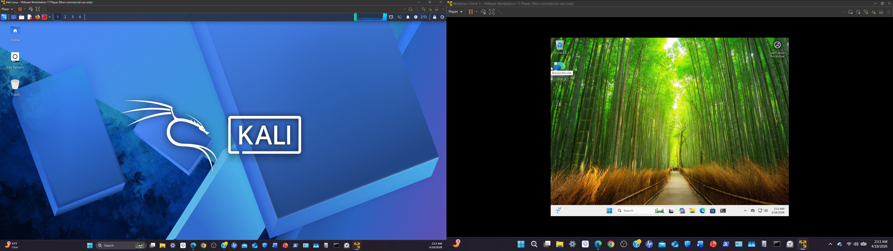
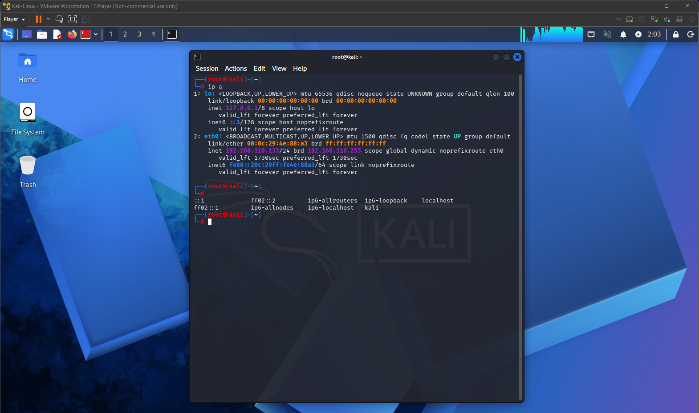
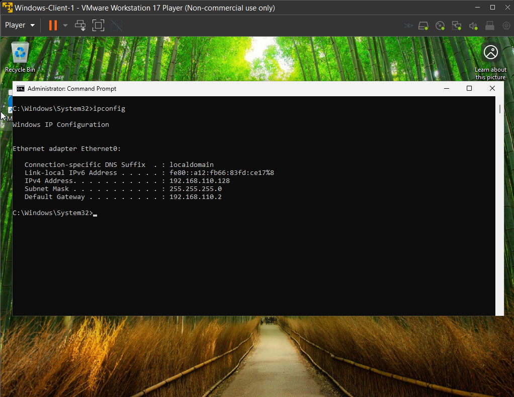
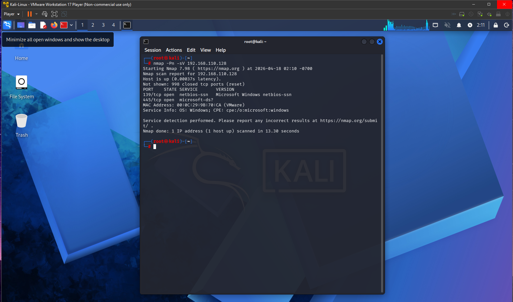

#  Lab 01 - Network Reconnaissance and Service Enumeration

## Overview  
This lab demonstrates a basic cybersecurity home lab where network reconnaissance was performed using Kali Linux against a Windows virtual machine. The objective was to simulate real world penetration testing techniques by identifying open ports and exposed services within a controlled environment.

---

## Lab Setup  

- **Host Machine:** Windows Laptop  
- **Virtualization:** VMware Workstation Player  
- **Attacker Machine:** Kali Linux VM  
- **Target Machine:** Windows 10/11 VM  
- **Network Type:** NAT (same subnet)

---

## Tools Used  

- **Nmap** (Network scanning)  
- **Kali Linux Terminal**  
- **Windows Command Prompt**

---

## Network Configuration  

- **Kali Linux IP:** 192.168.110.133  
- **Windows VM IP:** 192.168.110.131  
- Verified connectivity using ping and IP configuration commands  

---

## Tasks Performed  

- Identified IP addresses on both machines  
- Verified connectivity using ping  
- Performed a service and port scan using Nmap  
- Analyzed open ports and detected services  

---

## Commands Used  

- ip a
- ipconfig
- ping 192.168.110.131
- nmap -Pn -sV 192.168.110.131

---

## Screenshots  

### VM Network Setup  

### Kali Linux IP Address  

### Windows IP Address  

### Ping Connectivity Test  

### Nmap Command Execution  

### Nmap Scan Results  

---

## Results  

- Successfully established network connectivity between Kali Linux and the Windows VM  
- Identified active host on the network using ICMP ping  
- Discovered open ports and associated services on the target machine  
- Detected common Windows services including:  
  - 139/tcp (NetBIOS)  
  - 445/tcp (SMB)  
  

---

## Key Takeaways  

- Learned how to enumerate a target system using Nmap  
- Understood how network services expose potential attack surfaces  
- Gained hands-on experience validating connectivity and scanning hosts  
- Built a foundational workflow for reconnaissance in a controlled lab environment  

---

## Skills Demonstrated  

- Network reconnaissance and enumeration techniques  
- Use of Nmap for port scanning and service detection  
- Basic TCP/IP networking concepts and subnet verification  
- Command line proficiency in both Linux and Windows environments  
- Connectivity troubleshooting using ping and IP configuration tools  
- Identification of common Windows network services and ports  
- Analysis of scan results to assess potential security exposure  
- Documentation of technical findings using structured README format  

## Conclusion  

This lab demonstrated how basic network reconnaissance can be performed using Kali Linux against a Windows system. Connectivity was verified before executing a service scan to identify open ports and running services. The results showed several common Windows services that could be further analyzed for vulnerabilities. This exercise reinforced the importance of reconnaissance as the first step in penetration testing. Overall, the lab provided practical experience in identifying and analyzing network exposure.

