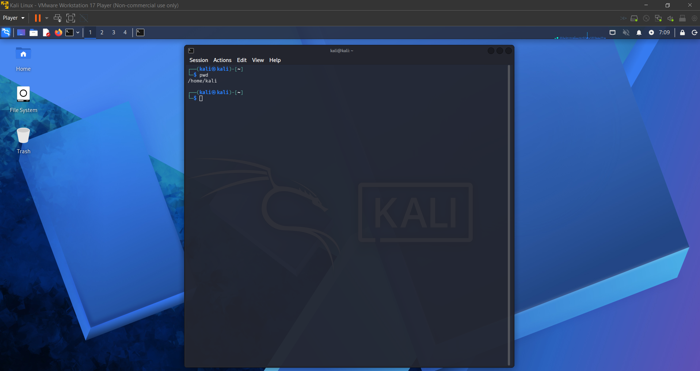
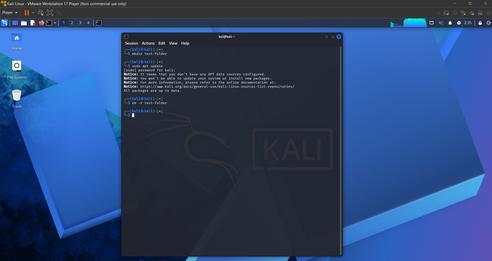
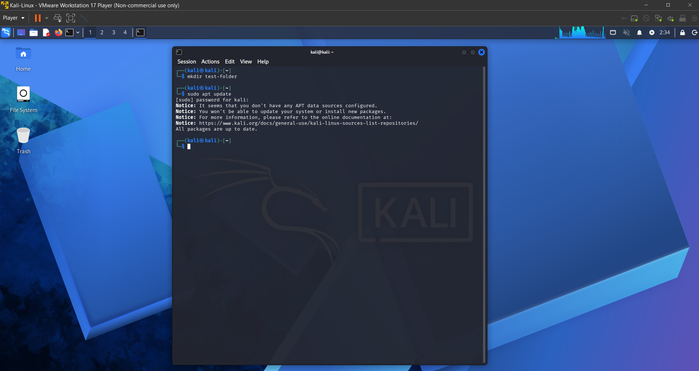

# Lab 2 - Linux System Operations and File Permission Management

## Overview
This lab demonstrates basic Linux command line operations and file permission management using Kali Linux. The objective was to gain hands on experience navigating the file system, creating and deleting directories, using elevated privileges, and modifying file permissions for scripts.

---

## Lab Setup
- Host Machine: Windows Laptop  
- Virtualization: VMware Workstation Player  
- Operating System: Kali Linux VM  
- Network Type: NAT  

---

## Tools Used
- Kali Linux Terminal  
- Linux Commands: sudo, mkdir, rm, chmod, ls  

---

## Tasks Performed

### 1. Accessed Kali Linux Terminal
Opened the terminal and navigated the Linux file system using basic commands.

---

### 2. Created Directory
Created a new directory using:

mkdir test-directory

This demonstrates basic file system management.

---

### 3. Removed Directory
Deleted the directory using:

rm -r test-directory

This demonstrates how to safely remove files and directories.

---

### 4. Used sudo for Elevated Privileges
Executed commands with administrative privileges using:

sudo command

This is required for system level changes.

---

### 5. Modified File Permissions
Changed file permissions using:

chmod 755 script.sh

Permission breakdown:
- Owner: read, write, execute  
- Group: read, execute  
- Others: read, execute  

---

### 6. Verified Permissions and Script Execution
Verified permissions using:

ls -l script.sh

Confirmed the script could execute properly.

---

## Results
- Successfully navigated the Linux file system  
- Created and removed directories  
- Executed commands with elevated privileges  
- Modified and verified file permissions  
- Executed scripts with proper access rights  

---

## Key Takeaways
- Linux file system operations are command driven  
- sudo is required for administrative actions  
- chmod controls access levels for files  
- Proper permissions are required to execute scripts  
- Understanding file permissions is critical in cybersecurity and system administration  

---

## Skills Demonstrated
- Linux command line navigation  
- File and directory management  
- File permission modification using chmod  
- User and group permission concepts  
- Understanding Linux file system structure  

## Conclusion
This lab provided hands on experience with essential Linux system operations and file permission management. By creating and removing directories, using elevated privileges, and modifying file permissions, I developed a strong foundation in Linux command line usage. These skills are fundamental for IT support, system administration, and cybersecurity roles.
