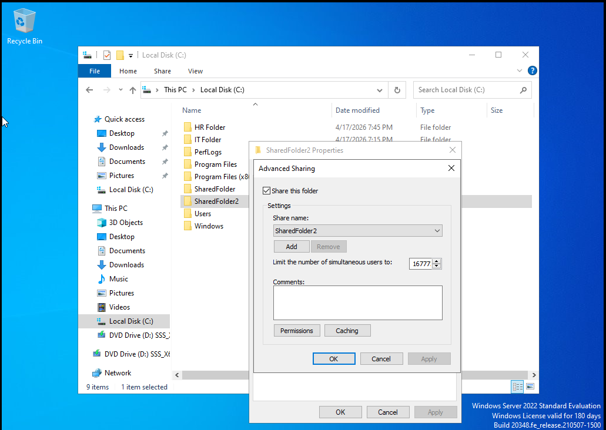
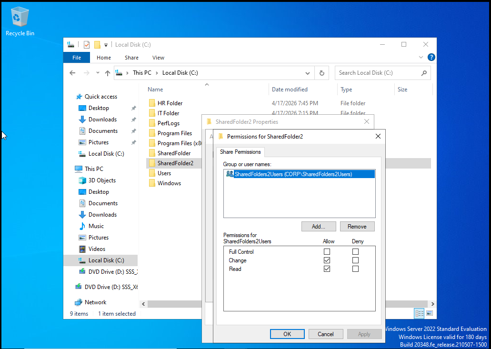
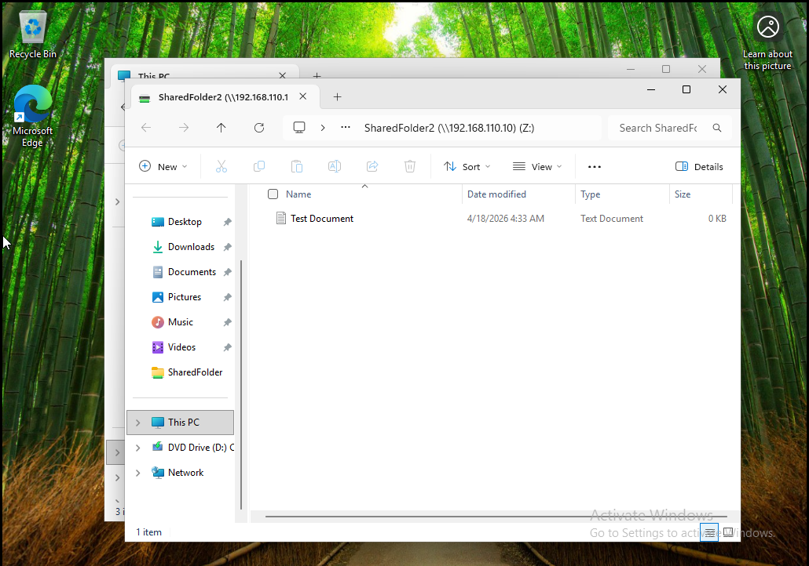
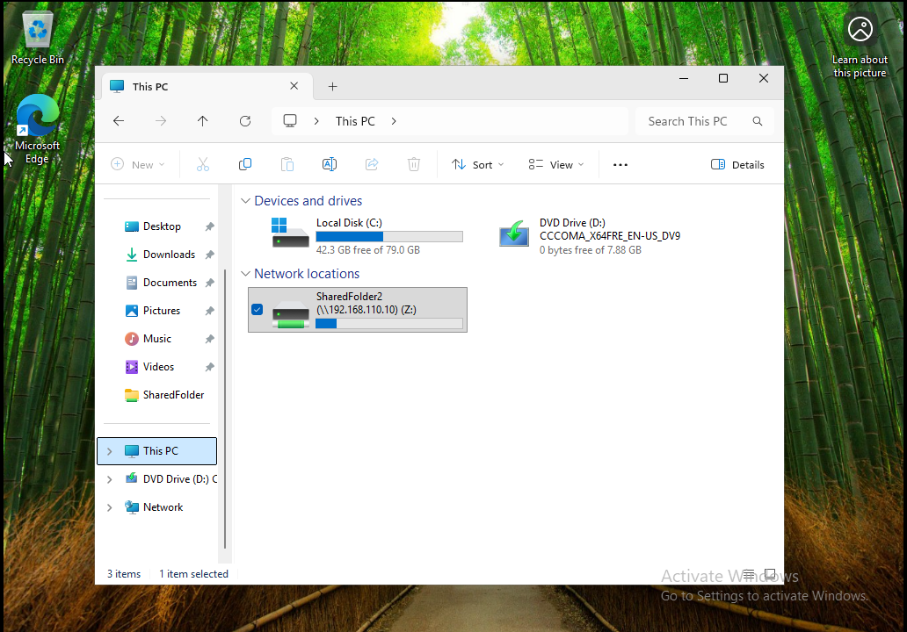

# Lab 5 - Network Drive Mapping and File Sharing

## Overview
This lab demonstrates how to configure network file sharing and map a network drive in a Windows environment. The objective was to simulate a real world IT support scenario where shared resources are created and accessed across machines on the same network.

---

## Lab Setup
- Host Machine: Windows Laptop  
- Virtualization: VMware Workstation Player  
- Server Machine: Windows Server or Windows VM  
- Client Machine: Windows 10 or 11 VM  
- Network Type: NAT  

---

## Tools Used
- File Explorer  
- Server Manager  
- Network Sharing  
- Command Prompt  

---

## Tasks Performed

### 1. Created Shared Folder
Created a folder on the server machine to be shared across the network:

C:\SharedFolder2

Configured the folder for sharing using Advanced Sharing settings.

---

### 2. Configured Share Permissions
Enabled sharing and assigned permissions:

- Enabled "Share this folder"
- Added "Everyone"
- Assigned appropriate access permissions

This allows other machines on the network to access the shared resource.

---

### 3. Verified Network Path
Identified the network path of the shared folder using the server IP address:

\\192.168.110.2\SharedFolder

Confirmed both machines were on the same subnet.

---

### 4. Mapped Network Drive
On the client machine:

- Opened File Explorer
- Selected "Map network drive"
- Assigned drive letter (Z:)
- Entered network path

\\192.168.110.2\SharedFolder

Successfully connected the shared folder as a mapped drive.

---

### 5. Verified Access
Confirmed that the mapped drive appeared under "This PC" and allowed access to files within the shared folder.

---

## Results
- Successfully created and shared a network folder  
- Configured permissions for network access  
- Mapped a network drive from a client machine  
- Verified file access across systems  

---

## Key Takeaways
- Network shares allow centralized file access across systems  
- Proper permissions are critical for security and functionality  
- Mapping a network drive improves usability for end users  
- Understanding SMB paths is essential for IT support roles  

---

## Skills Demonstrated
- User account creation and management  
- Security group configuration  
- Group based access control  
- NTFS permissions management  
- Shared folder access control  

## Conclusion
This lab demonstrated how to create and manage shared network resources in a Windows environment. By configuring folder sharing, assigning permissions, and mapping a network drive, full access between systems was successfully established. This exercise reflects common real world IT support tasks involving file servers and user access management.

---

## Ticket Scenario  

**Scenario:**  
A user is unable to access a shared network drive that other team members can access without issues.

**Issue:**  
The user receives an “Access Denied” error when attempting to open the shared folder.

**Diagnosis:**  
Verified network connectivity and confirmed the shared drive was reachable. Checked user group membership and reviewed NTFS and share permissions on the folder.

**Resolution:**  
Added the user to the appropriate security group and updated folder permissions to grant the required access level.

**Verification:**  
User successfully accessed the shared drive and was able to open, create, and modify files as expected.

