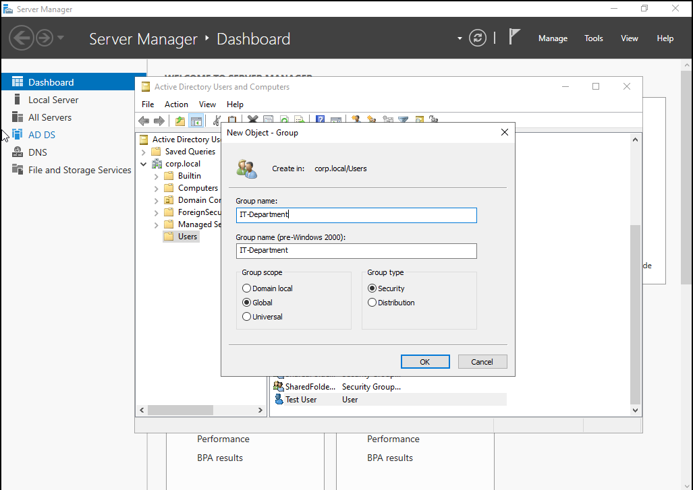
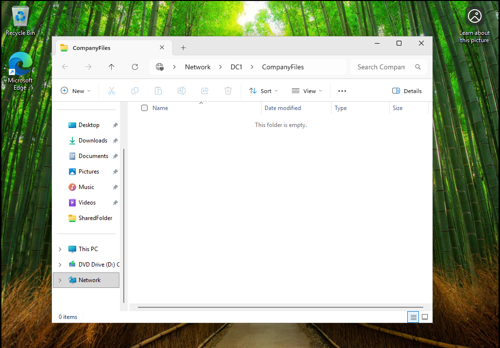

# Lab 6 - Active Directory User and Group Management

## Overview
This lab demonstrates how to create and manage users and groups in Active Directory and assign permissions to shared resources.

---

## Lab Setup
- **Host Machine:** Windows Laptop
- **Virtualization:** VMware Workstation Player
- **Domain Controller:** Windows Server 2022 DC1
- **Client Machine:** Windows 10 or Windows 11 VM joined to the domain
- **Domain:** corp.local
- **Network Type:** NAT same subnet
- **Management Tool:** Active Directory Users and Computers
- **Shared Resource:** Shared folder with group based permissions

---

## Skills Demonstrated
- Active Directory user creation
- Security group management
- File sharing and permissions
- Access control validation

---

## Tasks Performed

### Created User

### Created Group

### Added User to Group

### Configured Shared Folder

### Set Permissions

### Verified Access

---

## Skills Demonstrated
- Active Directory user provisioning  
- Group membership management  
- Permission assignment using AD  
- Organizational unit navigation  
- Enterprise user management workflows  

## Conclusion

This lab successfully demonstrated the process of creating and managing users and groups within Active Directory, along with assigning and validating permissions to shared resources. By implementing proper group-based access control, this lab reinforced best practices for managing user access efficiently and securely in a domain environment. The ability to verify access and troubleshoot permission issues reflects real world help desk and system administration responsibilities, making this a foundational skill for IT support and cybersecurity roles.
