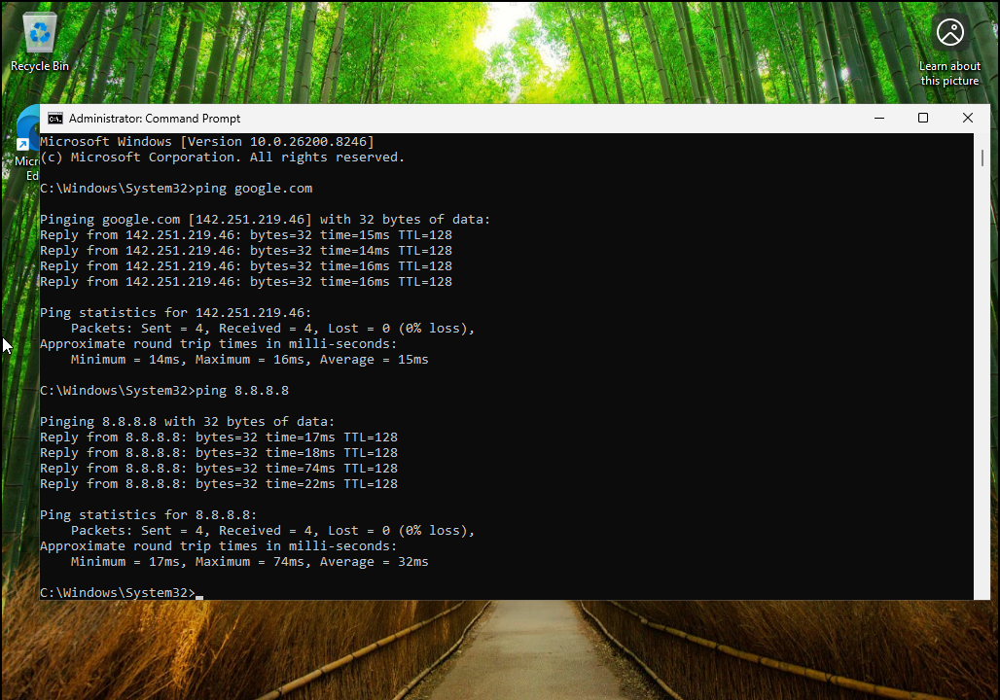
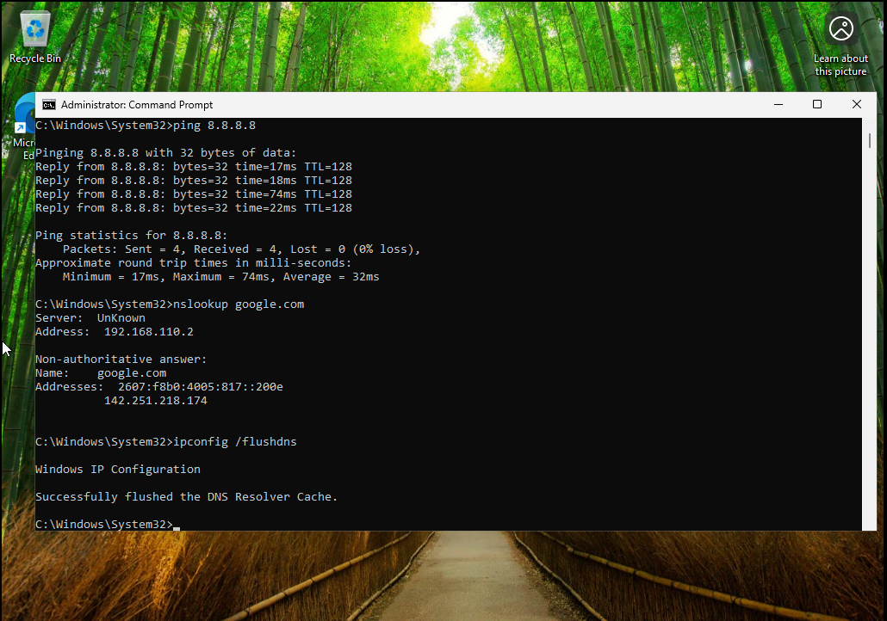

# Lab 8 - DNS and Network Connectivity Troubleshooting

## Overview
This lab demonstrates how to diagnose and resolve DNS related network issues.

---

## Lab Setup
- Host Machine: Windows Laptop
- Virtualization: VMware Workstation Player
- Domain Controller: Windows Server 2022 DC1
- Client Machine: Windows 10 or Windows 11 VM joined to the domain
- Domain: corp.local
- Network Type: NAT same subnet
- Primary Tools: Command Prompt, PowerShell, DNS Manager
- Testing Commands: ipconfig, ping, nslookup, tracert
- Troubleshooting Focus: DNS resolution and network connectivity validation

---

## Skills Demonstrated
- DNS troubleshooting
- Network testing
- Command line tools

---

## Process

### DNS Failure

### IP Connectivity Works

### DNS Lookup

### DNS Fix

---

## Skills Demonstrated
- DNS troubleshooting and resolution  
- Network connectivity testing using ping  
- IP configuration analysis  
- Command line networking tools  
- Identifying and resolving network issues  

## Result
Successfully identified and resolved DNS issues affecting connectivity.
