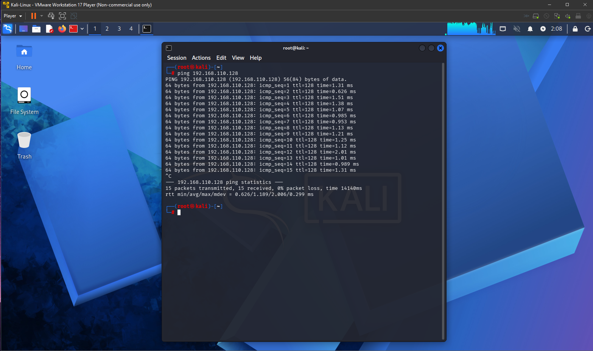
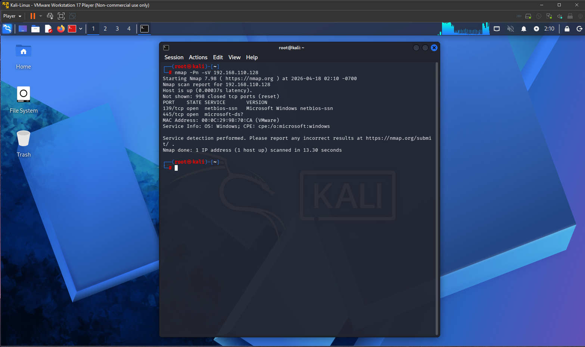
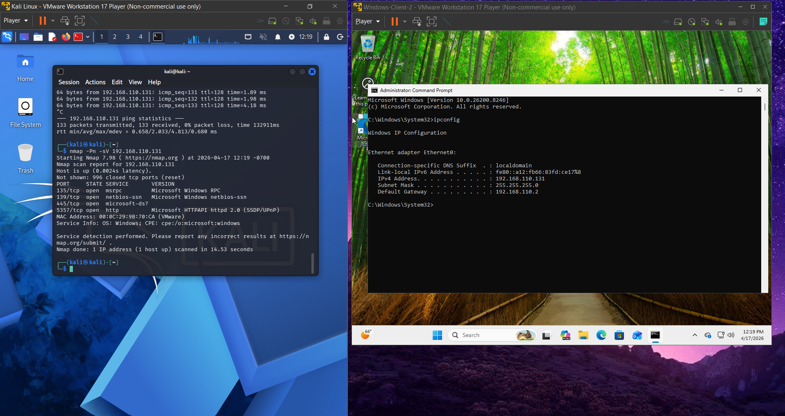

# Lab 1 - Network Reconnaissance

## Overview
This lab demonstrates basic network reconnaissance using Kali Linux to scan a Windows machine. The goal was to simulate real world penetration testing techniques by identifying open ports and services in a controlled environment.

---

## Lab Setup
- Host Machine: Windows Laptop  
- Virtualization: VMware Workstation Player  
- Attacker Machine: Kali Linux  
- Target Machine: Windows VM  
- Network Type: NAT (same subnet)  

---

## Tools Used
- Nmap  
- Kali Linux Terminal  
- Command Prompt  

---

## Tasks Performed

### 1. Identified IP Addresses

On Kali Linux:
ip a

On Windows:
ipconfig

This step was used to determine the IP addresses of both the attacker and target machines.

---

### 2. Verified Connectivity

Tested communication between machines using ping:

ping [target IP]

This confirmed both systems were on the same network and able to communicate.

---

### 3. Performed Nmap Scan

Executed a service version scan using Nmap:

nmap -Pn -sV [target IP]

This command scans for open ports and identifies running services on the target machine.

---

### 4. Analyzed Scan Results

The scan revealed multiple open ports and services, including common Windows services such as SMB and RPC.

---

## Results
- Successfully identified open ports on the target system  
- Verified network connectivity between attacker and target  
- Simulated a basic network reconnaissance scenario  

---

## Key Takeaways
- Learned how to identify IP addresses on different operating systems  
- Understood how to verify connectivity using ping  
- Gained hands on experience performing port scans with Nmap  
- Learned how attackers gather information during the reconnaissance phase  

---

## Conclusion
This lab demonstrated the fundamentals of network reconnaissance using Kali Linux and Nmap in a controlled environment. I successfully identified IP addresses, verified connectivity, and scanned a target machine for open ports and services. This process helped me understand how systems communicate and how attackers gather information during the early stages of penetration testing. I also gained hands on experience using command line tools and interpreting scan results. Overall, this lab built a strong foundation for more advanced cybersecurity tasks such as vulnerability scanning and exploitation.
