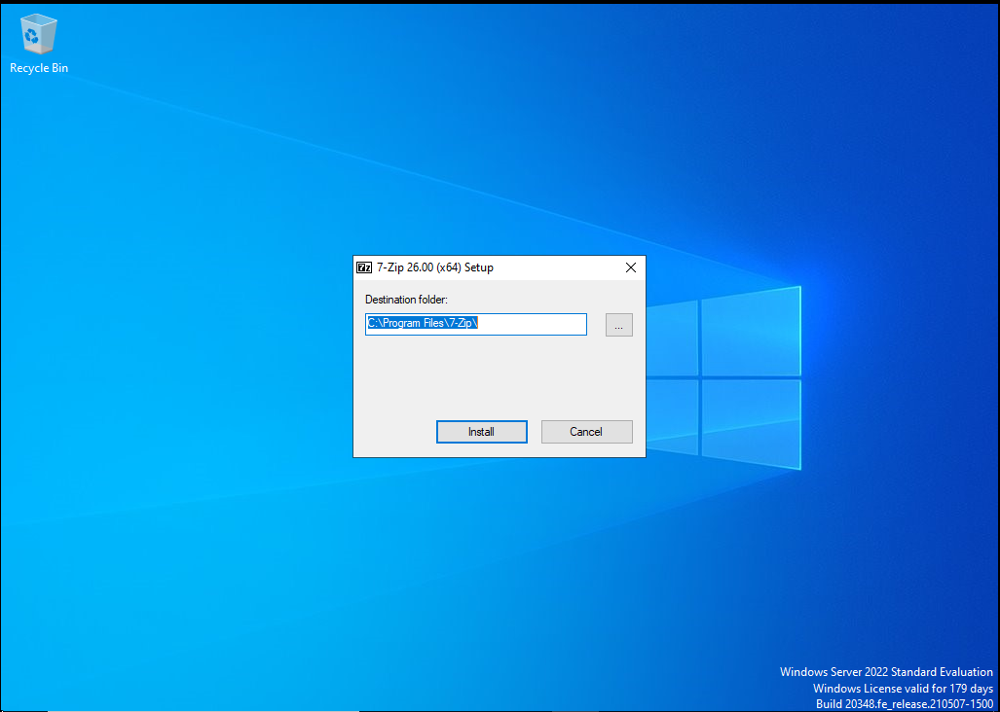
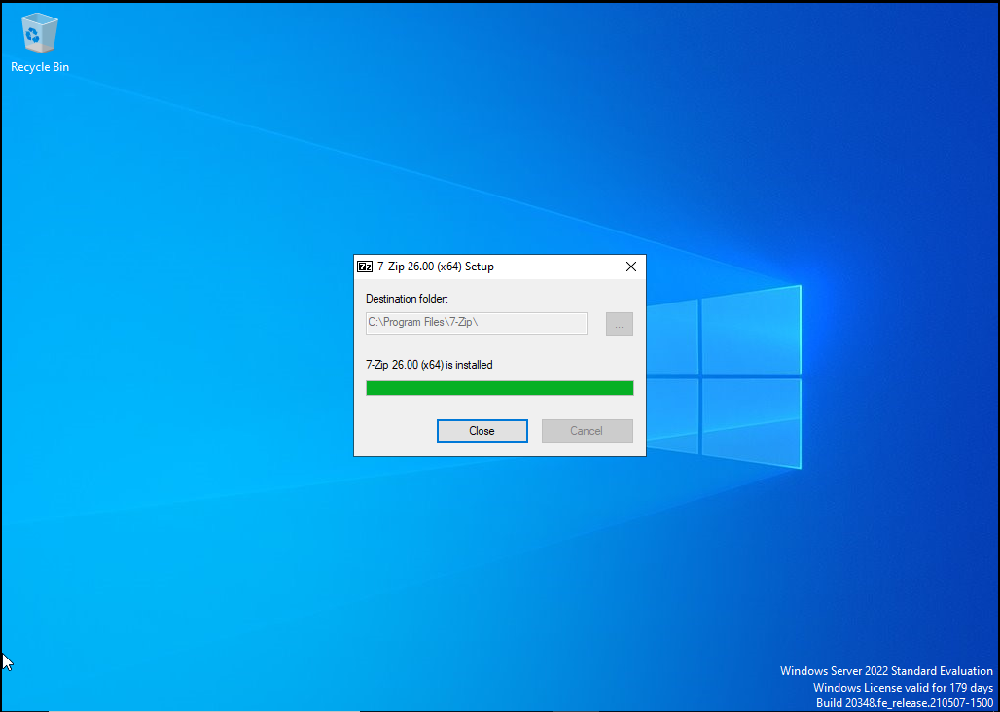
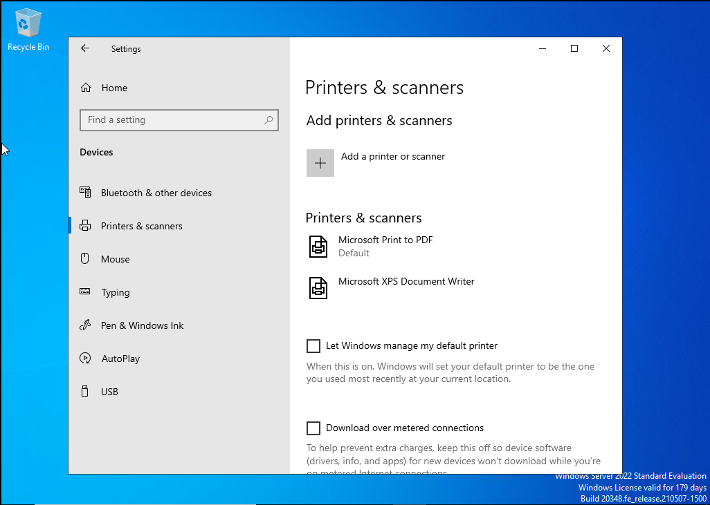
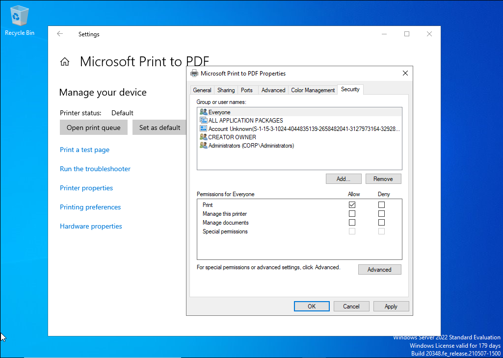
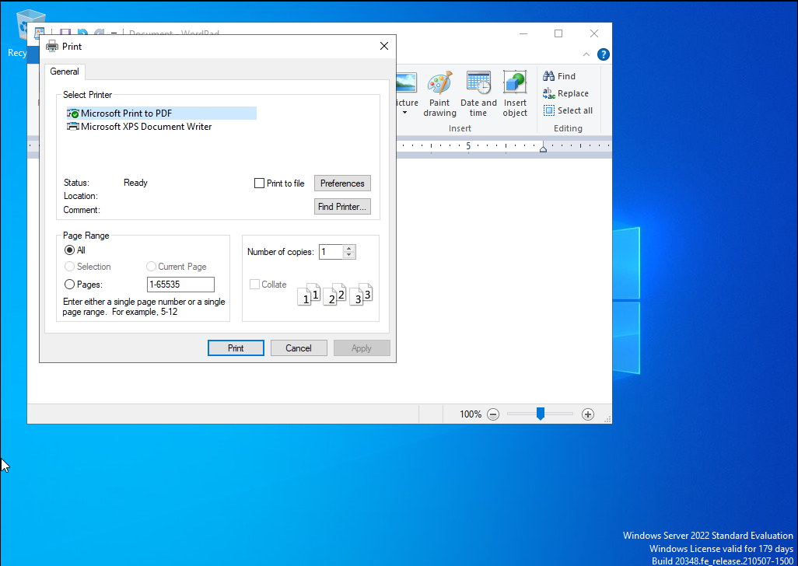
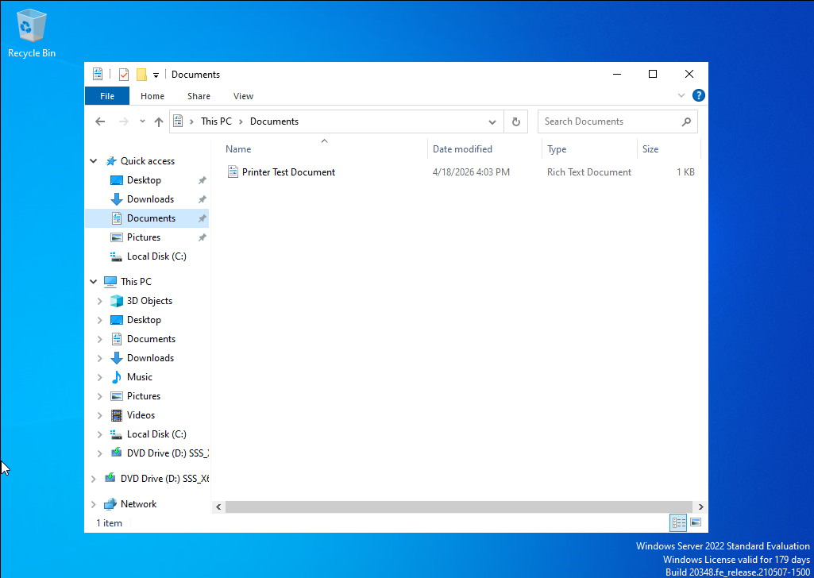

Lab 10 - Software Installation and Printer Troubleshooting

Overview  
This lab demonstrates basic desktop support tasks in a Windows environment by installing software and troubleshooting printer functionality. The goal was to simulate a real world IT support scenario where an end user needs a program installed and a printer tested to confirm successful output.

Lab Setup  
Host Machine: Windows Laptop  
Virtualization: VMware Workstation  
Client Machine: Windows 11 VM  
Network Type: NAT  

Tools Used  
Windows Settings  
Control Panel  
File Explorer  
Microsoft Print to PDF  
Software Installer  

Tasks Performed  

1. Software Installation Preparation  
Downloaded a software installer to the Windows client machine and verified it was ready to run.

---

2. Installed Software  
Ran the installer and completed the setup process using the default installation options.

---

3. Verified Application Launch  
Opened the installed application to confirm the software was installed successfully and functioning properly.

---

4. Opened Printer Settings  
Navigated to Printers and scanners in Windows Settings to review available printers and confirm printer visibility.

---

5. Selected Printer for Troubleshooting  
Selected Microsoft Print to PDF and reviewed its settings to verify printer status and availability.

---

6. Performed Test Print  
Printed a sample file using Microsoft Print to PDF to simulate printer troubleshooting and confirm output processing.

---

7. Verified Printer Output  
Confirmed the PDF file was successfully created and saved, proving the print job completed correctly.

---

Results  
- Successfully installed software on the Windows client machine  
- Verified the installed application opened correctly  
- Accessed and reviewed printer settings in Windows  
- Completed a successful test print using Microsoft Print to PDF  
- Confirmed printer output by saving and viewing the generated PDF file  

---

Skills Demonstrated  
- Software installation and verification  
- Basic Windows desktop support  
- Printer setup and troubleshooting  
- Device and peripheral validation  
- End user support workflow simulation  

---

Conclusion  
This lab provided hands on experience with two common IT support tasks: software installation and printer troubleshooting. By successfully installing an application and verifying printer output through Microsoft Print to PDF, I strengthened practical desktop support skills used in real help desk environments. These tasks reflect common end user requests and reinforce foundational troubleshooting abilities for entry level IT roles.
