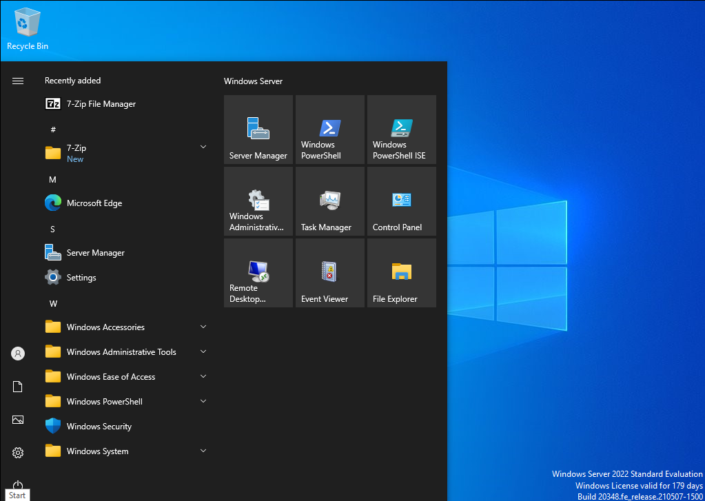
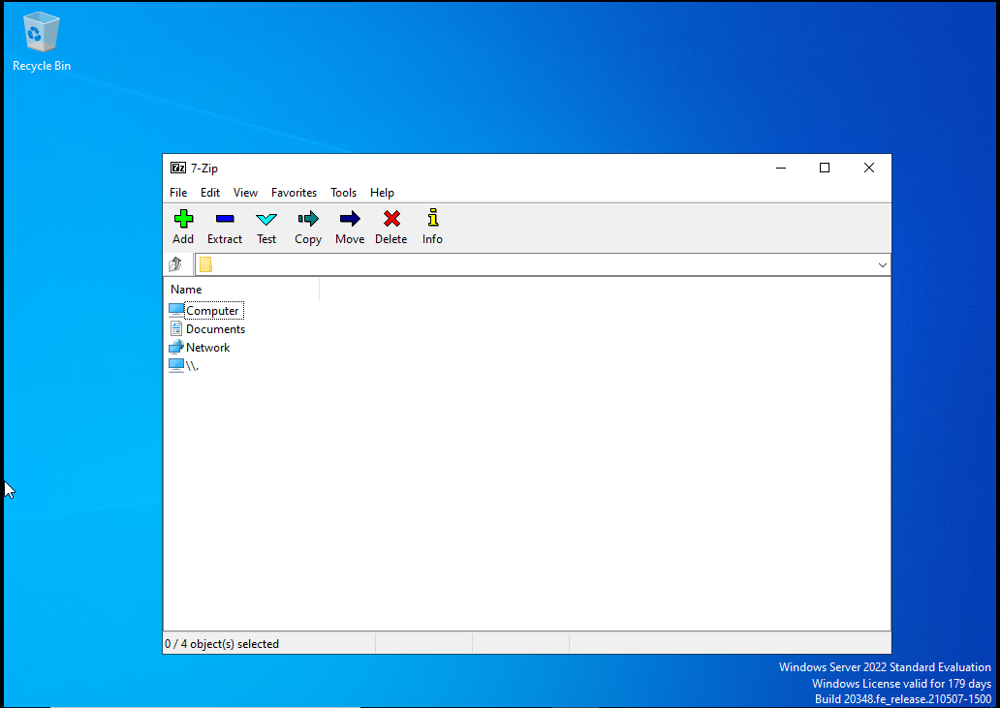
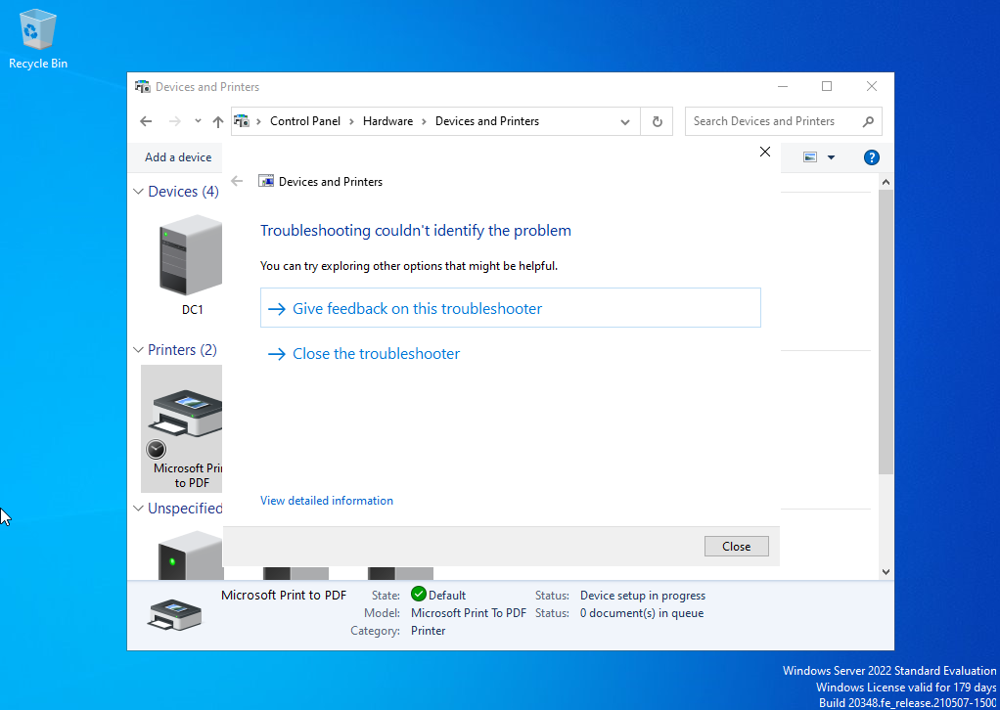
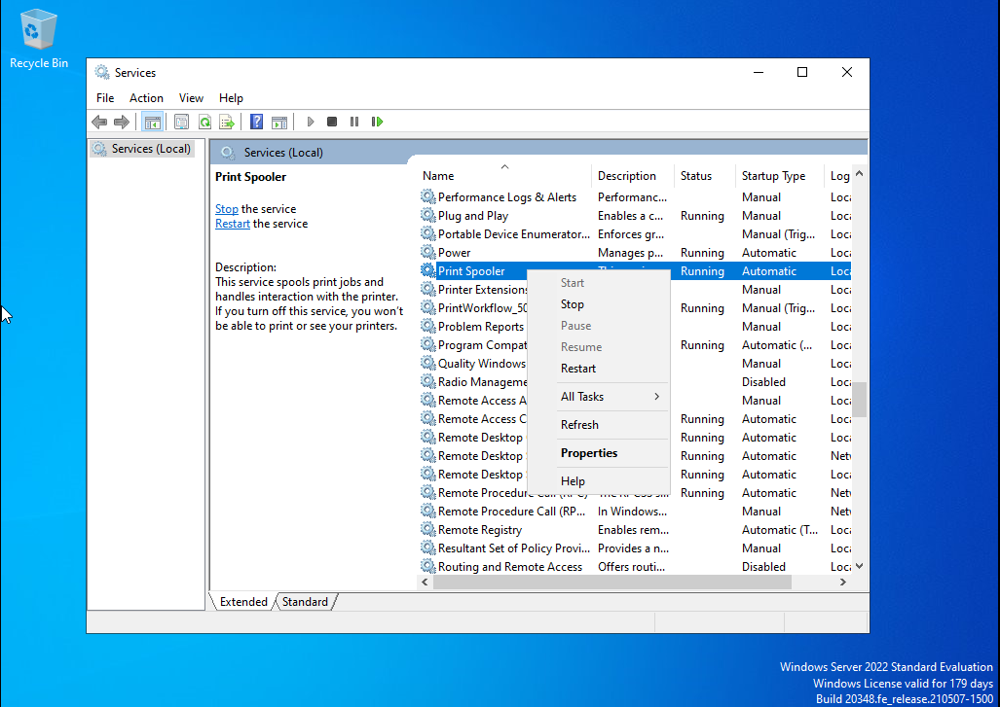
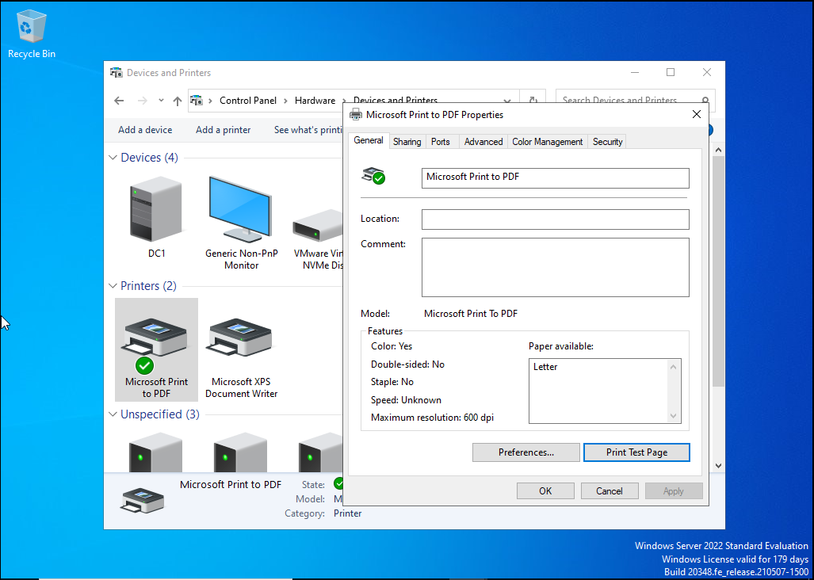

# Lab 10 - Windows Troubleshooting and Printer Support

## Overview  
This lab simulates a real world IT support scenario involving software installation and printer troubleshooting on a Windows system. The objective was to diagnose common user issues, restore functionality, and verify successful operation using standard help desk procedures.

---

## Lab Setup  

- **Host Machine:** Windows Laptop  
- **Virtualization:** VMware Workstation Player  
- **Target Machine:** Windows 10/11 VM  
- **Network Type:** NAT  

---

## Tools Used  

- Windows Settings  
- Control Panel  
- Services (services.msc)  
- Command Prompt  
- Devices and Printers  

---

## Tasks Performed  

1. Installed a basic software application  
2. Verified application functionality  
3. Simulated printer issue (printer offline or not printing)  
4. Restarted Print Spooler service  
5. Removed and re-added printer  
6. Printed a test page to confirm functionality  

---

## Step by Step Instructions  

### Step 1 - Install Software  
- Download and install a simple application (example: Google Chrome or Notepad++)  
- Verify the application launches successfully  

📸 Screenshot: software-installed.png  

---

### Step 2 - Verify Application Functionality  
- Open the installed application  
- Confirm it runs without errors  

📸 Screenshot: app-open.png  

---

### Step 3 - Simulate Printer Issue  
- Go to **Devices and Printers**  
- Set printer to offline or observe failed print job  

📸 Screenshot: printer-issue.png  

---

### Step 4 - Restart Print Spooler Service  
- Open Run → type `services.msc`  
- Locate **Print Spooler**  
- Restart the service  

📸 Screenshot: spooler-restart.png  

---

### Step 5 - Print Test Page  
- Right click printer → Printer Properties  
- Click **Print Test Page**  
- Confirm successful print  

📸 Screenshot: test-print.png  

---

## Commands Used  

```bash
services.msc
```

---

## Screenshots  

### Software Installed  


### Application Opened Successfully  


### Printer Issue Detected  


### Print Spooler Restart  


### Test Page Printed  


---

## Results  

- Successfully installed and verified software functionality  
- Identified and diagnosed printer connectivity issue  
- Restarted critical Windows service to resolve printing failure  
- Restored printer functionality and confirmed successful test print  

---

## Key Takeaways  

- Learned how to troubleshoot common Windows printer issues  
- Understood the role of the Print Spooler service in print management  
- Gained experience installing and verifying software in a Windows environment  
- Reinforced structured troubleshooting methodology used in IT support  

---

## Ticket Scenario  

**Scenario:**  
A user reports that they are unable to print documents and their printer appears offline.

**Issue:**  
Printer is not responding and print jobs are stuck in the queue.

**Diagnosis:**  
Checked printer status in Devices and Printers and identified that the Print Spooler service was not functioning properly.

**Resolution:**  
Restarted the Print Spooler service and reinitialized the printer connection.

**Verification:**  
Printed a successful test page and confirmed the user could resume normal printing operations.

---

## Skills Demonstrated  

- Windows troubleshooting and system diagnostics  
- Software installation and validation  
- Printer troubleshooting and configuration  
- Service management using Windows tools  
- Problem solving using structured IT support workflows  
