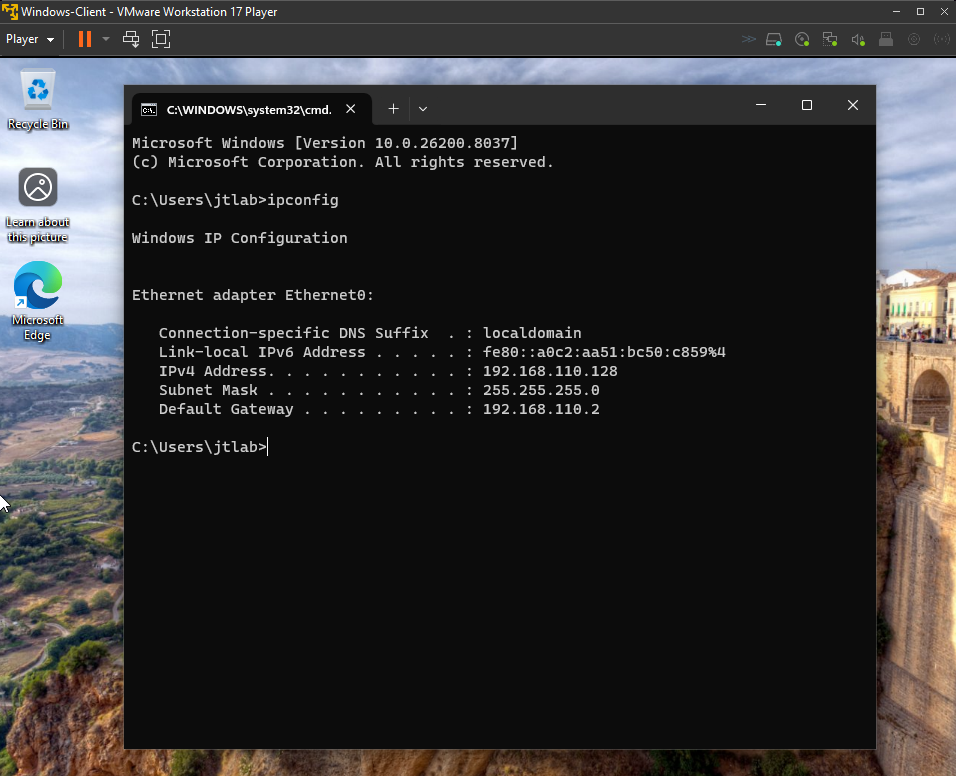
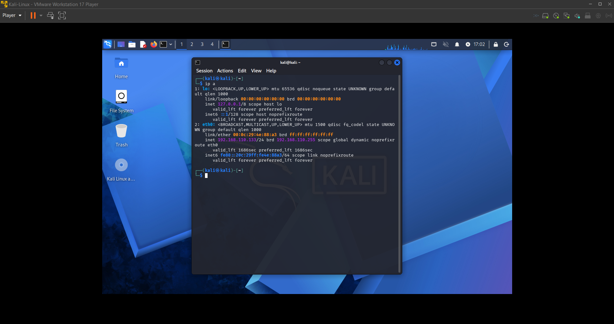
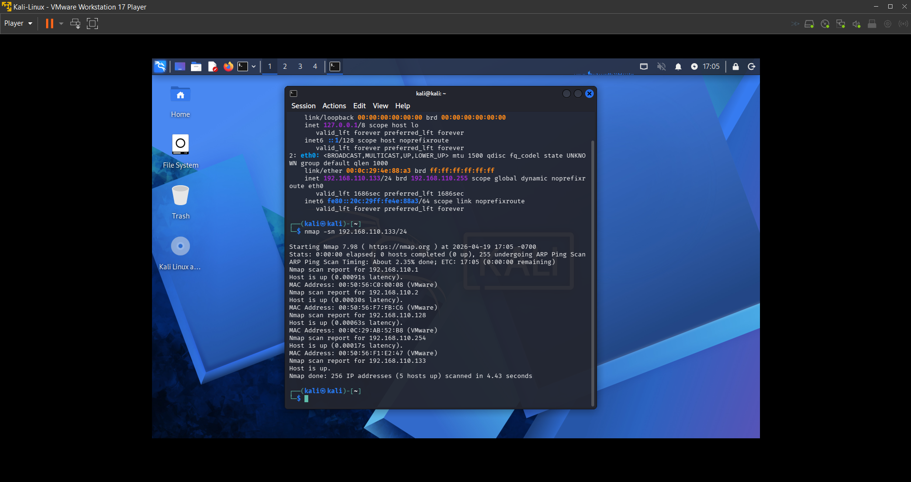
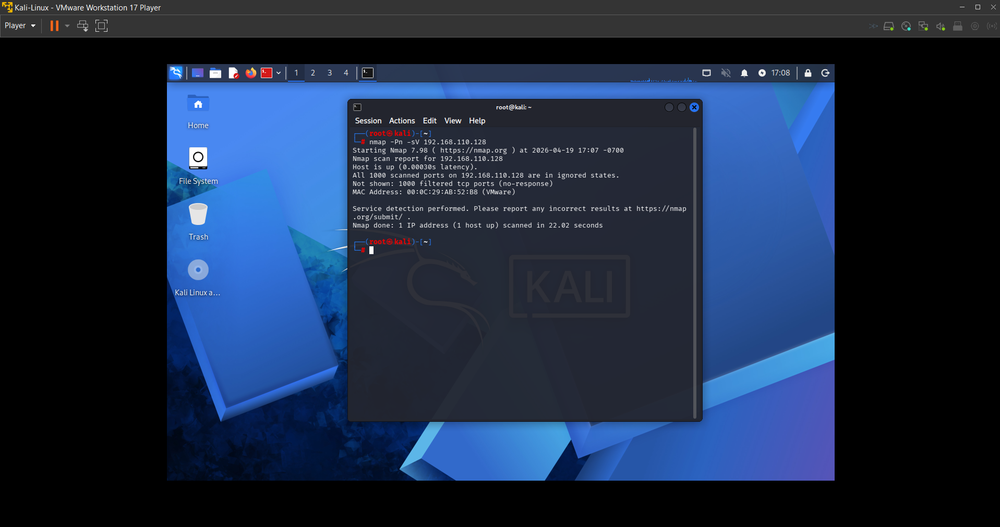
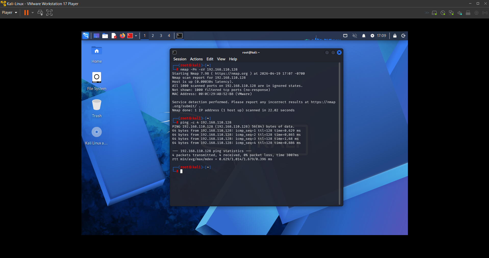
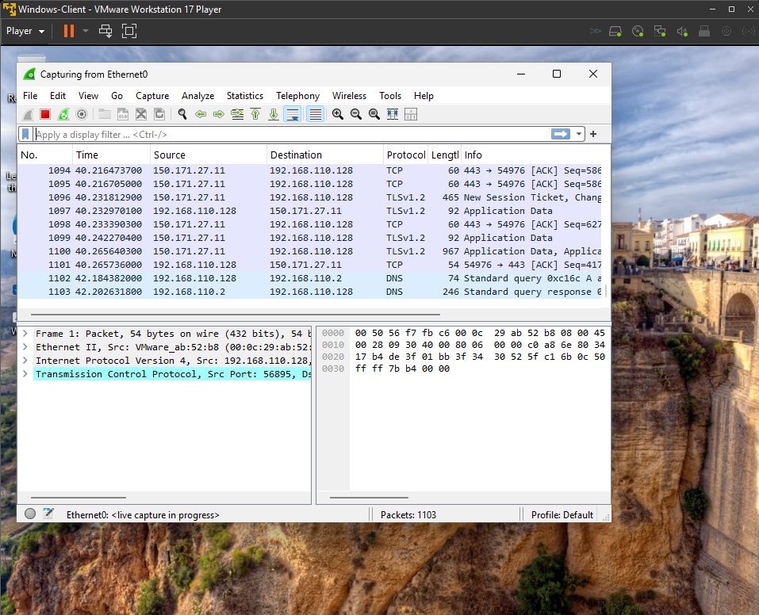
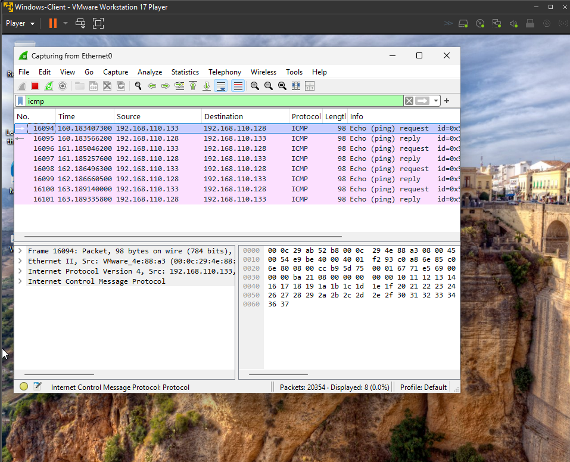
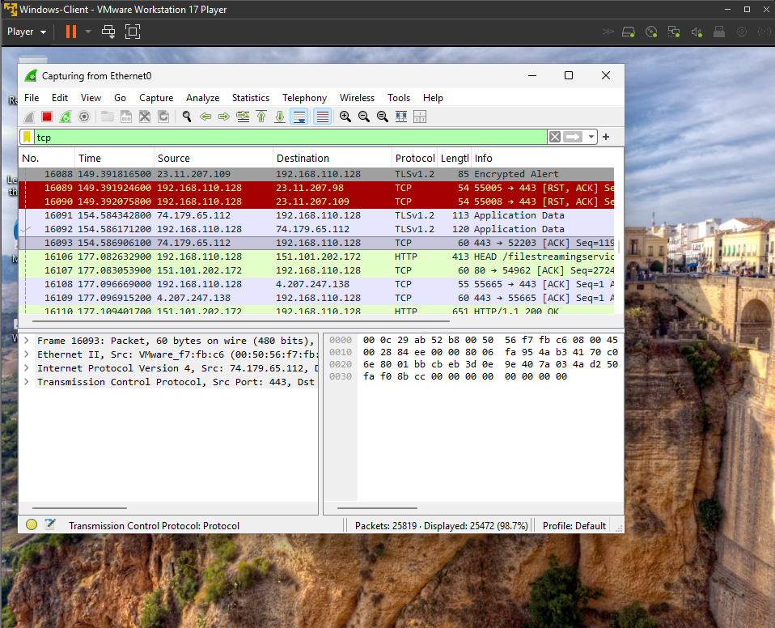
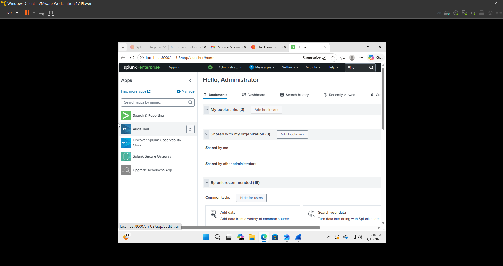
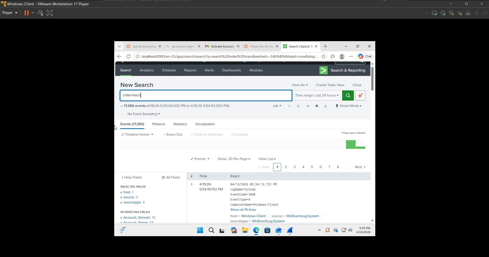

# Lab 12 - Network Traffic Analysis and Security Monitoring with Nmap, Wireshark, and Splunk

## Overview

This lab demonstrates a hands on IT and cybersecurity workflow using Kali Linux, Nmap, Wireshark, and Splunk in a virtual machine environment. The objective was to identify a target system on the network, verify connectivity, capture live packet traffic, and review system log visibility through Splunk. This simulates a real world support and security scenario involving network reconnaissance, packet analysis, and basic monitoring.

---

## Lab Setup

- **Host Machine:** Windows Laptop  
- **Virtualization:** VMware Workstation Player  
- **Analyst Machine:** Kali Linux VM  
- **Target Machine:** Windows 10 or 11 VM  
- **Log Analysis Platform:** Splunk  
- **Network Type:** NAT or Host Only  

---

## Tools Used

- **Nmap**  
- **Wireshark**  
- **Splunk**  
- **Kali Linux Terminal**  
- **Windows Command Prompt**  

---

## Network Configuration

- **Kali Linux IP:** [Enter Kali IP]  
- **Windows VM IP:** [Enter Windows IP]  

Both virtual machines were connected to the same subnet to allow communication and analysis.

---

## Tasks Performed

### Step 1 - Identified Windows IP Address

Opened Command Prompt on the Windows virtual machine and used ipconfig to identify the system IP address.

```cmd
ipconfig
```



---

### Step 2 - Identified Kali Linux IP Address

Opened the Kali Linux terminal and used ip a to determine the IP address of the attacker machine.

```bash
ip a
```



---

### Step 3 - Discovered Live Hosts with Nmap

Performed a ping scan across the subnet to identify active systems on the network.

```bash
nmap -sn 192.168.110.0/24
```



---

### Step 4 - Performed Service Enumeration

Executed a targeted Nmap scan against the Windows VM to identify open ports and running services.

```bash
nmap -Pn -sV [windows-ip]
```



---

### Step 5 - Verified Connectivity with Ping

Used ping from Kali Linux to confirm communication with the Windows system.

```bash
ping -c 4 [windows-ip]
```



---

### Step 6 - Started Packet Capture in Wireshark

Opened Wireshark on the Windows VM and started capturing traffic on the active network interface.



---

### Step 7 - Generated Network Traffic

Generated traffic from Kali Linux using ping and Nmap to simulate real network activity.

```bash
ping -c 4 [windows-ip]
nmap -Pn [windows-ip]
```

---

### Step 8 - Filtered ICMP Traffic in Wireshark

Applied an ICMP filter in Wireshark to observe ping request and reply packets.

```text
icmp
```



---

### Step 9 - Filtered TCP Traffic in Wireshark

Applied a TCP filter in Wireshark to analyze traffic generated by the Nmap scan.

```text
tcp
```



---

### Step 10 - Accessed Splunk

Opened Splunk and navigated to the Home dashboard.



---

### Step 11 - Queried Logs in Splunk

Executed search queries in Splunk to view available system logs.

```text
index=main
index=main sourcetype=WinEventLog:Security
*
host=*
```



---

## Commands Used
- ip a
- nmap -sn 192.168.110.0/24
- nmap -Pn -sV [windows-ip]
- ping -c 4 [windows-ip]
- nmap -Pn [windows-ip]
- ipconfig
- icmp
- tcp
- index=main
- index=main sourcetype=WinEventLog:Security
```

---

## Results

- Successfully identified IP addresses of both virtual machines  
- Discovered active hosts using Nmap  
- Enumerated open ports and services on the Windows VM  
- Verified connectivity between systems  
- Captured and analyzed ICMP and TCP traffic in Wireshark  
- Accessed and reviewed system logs in Splunk  

---

## Skills Demonstrated

- Network reconnaissance and host discovery  
- Port scanning and service enumeration  
- Network troubleshooting and connectivity testing  
- Packet capture and protocol analysis  
- Traffic filtering and interpretation using Wireshark  
- Basic SIEM usage and log analysis with Splunk  
- Understanding of network communication behavior  

---

## Ticket Scenario

A workstation on the internal virtual network needed to be identified, tested for connectivity, and reviewed for visible network activity. The objective was to verify that the system was reachable, observe live traffic generated during basic reconnaissance, and confirm whether system logs could be reviewed in Splunk for monitoring purposes. This simulates a real world IT and security workflow involving host discovery, packet analysis, and log visibility.

---

## Conclusion

This lab provided practical experience using multiple industry standard tools in a controlled environment. Nmap was used to identify systems and enumerate services, Wireshark was used to capture and analyze network traffic, and Splunk was used to review log data. The workflow demonstrated how network activity can be generated, monitored, and investigated across different platforms. This type of hands on experience directly reflects real world IT support and cybersecurity responsibilities.
