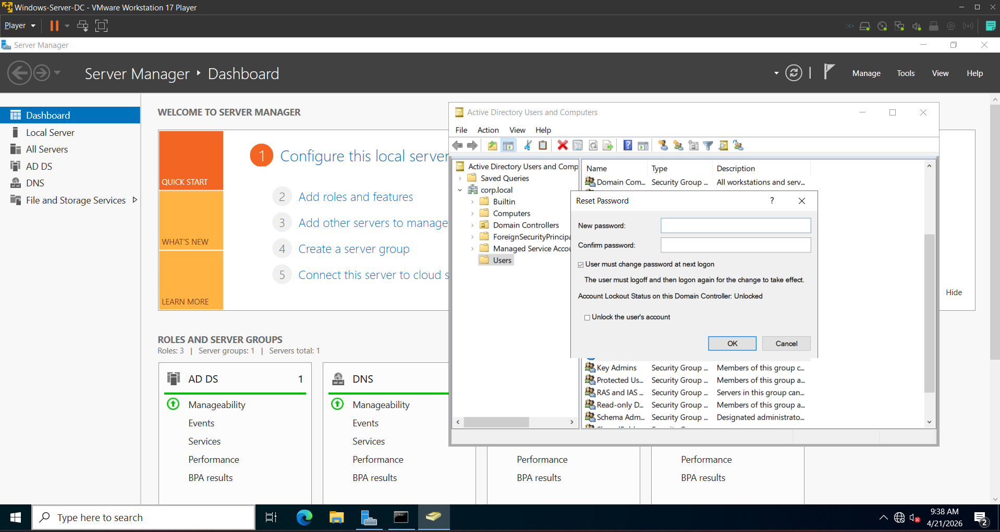
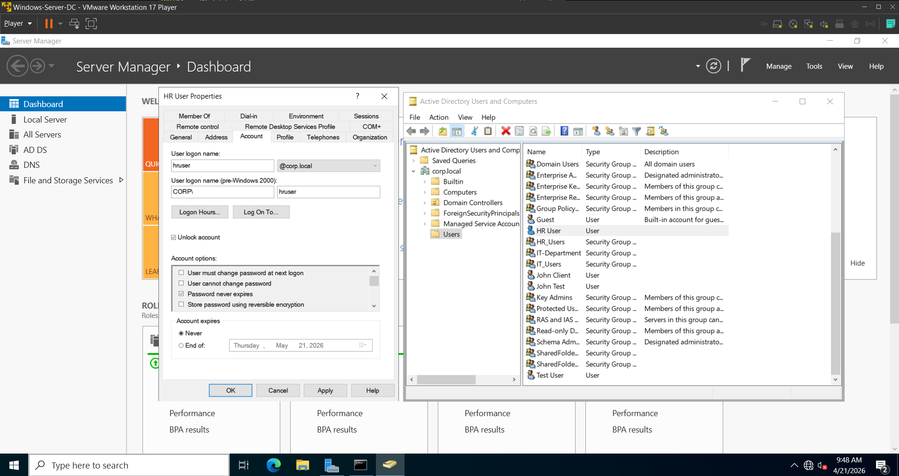
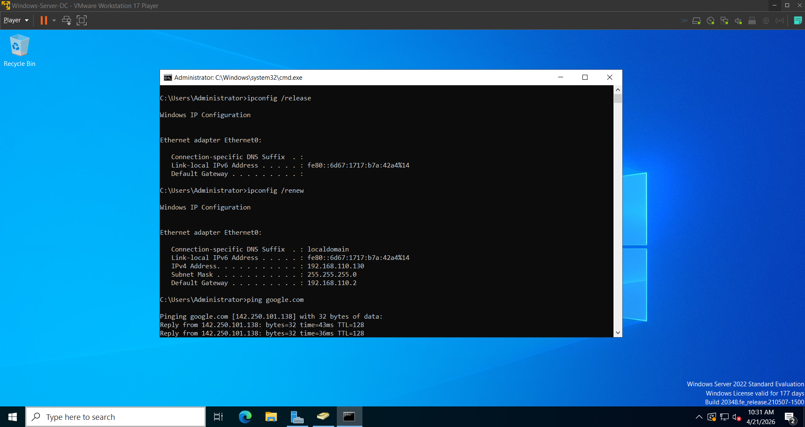
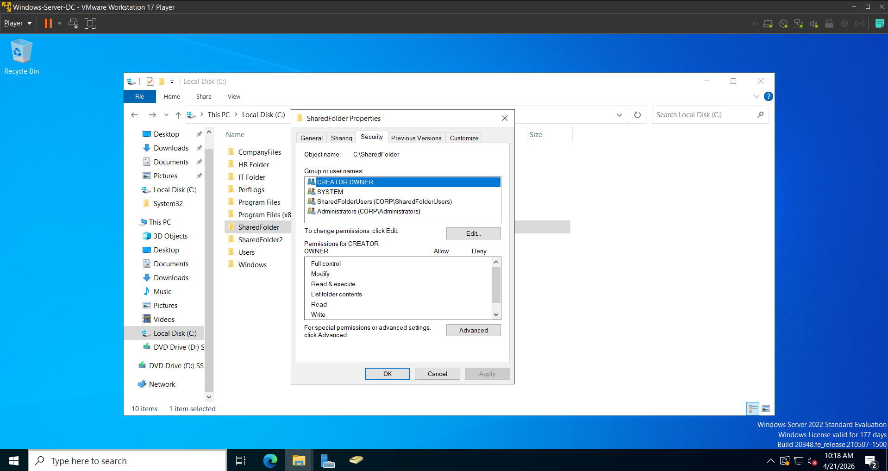
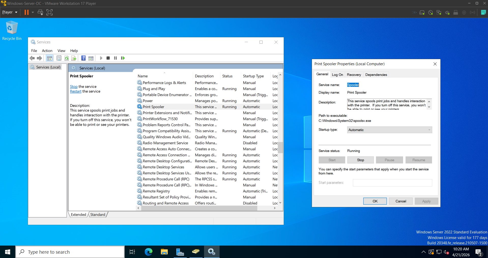
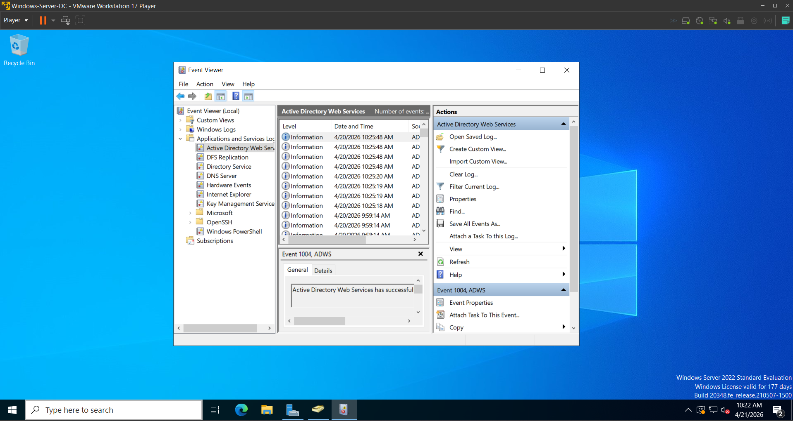

# Lab 13 - Help Desk Ticket Workflow Simulation

## Overview  
This lab simulates a real-world help desk environment by documenting multiple IT support tickets from intake to resolution. The objective is to demonstrate the ability to troubleshoot common technical issues, prioritize requests, document actions clearly, and follow a structured support workflow similar to enterprise IT environments.

---

## Lab Objectives  

- Simulate real help desk ticket handling  
- Practice troubleshooting across multiple issue types  
- Demonstrate ticket documentation and resolution workflows  
- Apply prioritization and escalation logic  
- Build experience similar to platforms like ServiceNow and Jira  

---

## Tools and Concepts Used  

- Windows 10/11  
- Active Directory Users and Computers  
- Command Prompt  
- Basic Networking (IP, DNS, Ping)  
- File Sharing and Permissions  
- Troubleshooting Methodology  

---

## Ticket 001 - Password Reset Request  

**Ticket ID:** 001  
**User Issue:** User unable to log in to workstation  
**Error Message:** Incorrect password  

**Priority:** Low  

**Diagnosis:**  
Verified that the user account was not locked out. Determined that the password was expired.

**Resolution:**  
Reset the user password in Active Directory and enabled “User must change password at next logon.”

**Verification:**  
User successfully logged in and created a new password.

**Screenshot:**  

---

## Ticket 002 - Account Locked Out  

**Ticket ID:** 002  
**User Issue:** User account locked after multiple failed login attempts  

**Priority:** Medium  

**Diagnosis:**  
Checked Active Directory and confirmed account lockout status.

**Resolution:**  
Unlocked the account in Active Directory and verified login access.

**Verification:**  
User successfully logged in without further issues.

**Screenshot:**  

---

## Ticket 003 - Network Connectivity Issue  

**Ticket ID:** 003  
**User Issue:** No internet connection  

**Priority:** High  

**Diagnosis:**  
- Ran `ipconfig` and identified missing or incorrect IP  
- Attempted to ping default gateway and failed  
- Confirmed DHCP-related issue  

**Resolution:**  
- Executed `ipconfig /release` and `ipconfig /renew`  
- Verified correct IP assignment  

**Verification:**  
User regained internet access and could browse successfully.

**Screenshot:**   

---

## Ticket 004 - Access Denied to Shared Folder  

**Ticket ID:** 004  
**User Issue:** Access denied when opening shared network drive  

**Priority:** Medium  

**Diagnosis:**  
- Verified connectivity  
- Checked group membership  
- Reviewed NTFS/share permissions  

**Resolution:**  
Added user to correct security group and updated permissions.

**Verification:**  
User accessed and modified files successfully.

**Screenshot:**  

---

## Ticket 005 - Printer Not Responding  

**Ticket ID:** 005  
**User Issue:** Printer not printing  

**Priority:** Medium  

**Diagnosis:**  
- Checked printer status  
- Identified stuck print queue  

**Resolution:**  
- Cleared print queue  
- Restarted print spooler service  

**Verification:**  
Printer successfully printed a test page.

**Screenshot:**  

---

## Ticket 006 - Escalation Scenario (Advanced Issue)  

**Ticket ID:** 006  
**User Issue:** Application crashes on startup  

**Priority:** High  

**Diagnosis:**  
- Reviewed system behavior  
- Checked Event Viewer logs  
- Issue persisted after basic troubleshooting  

**Resolution:**  
Escalated to Tier 2 support with detailed documentation of findings.

**Verification:**  
Escalation completed with full notes for further investigation.

**Screenshot:**  

---

## Skills Demonstrated  

- Help desk ticket workflow management  
- Troubleshooting and diagnostics  
- Active Directory account management  
- Network issue resolution  
- Permission and access control  
- Printer troubleshooting  
- Escalation procedures  
- Technical documentation  

---

## Conclusion  

This lab demonstrates the ability to operate within a structured help desk environment by handling multiple ticket scenarios from intake to resolution. It highlights real-world IT support skills including troubleshooting, user support, documentation, and escalation, which are essential for entry-level IT support and help desk roles.
