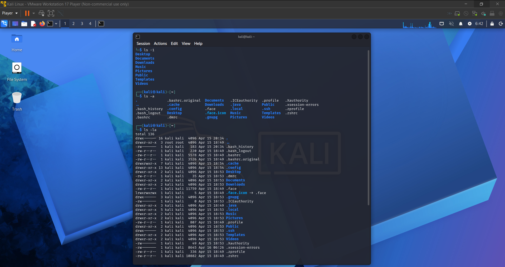
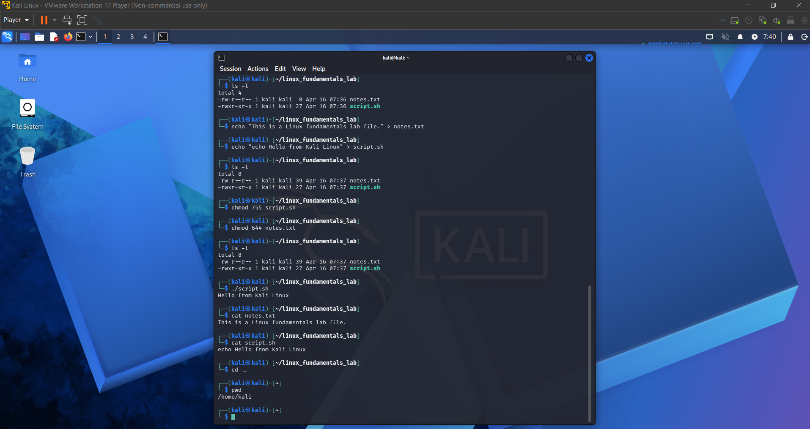

# Lab 2: Kali Linux Fundamentals

## Overview
This lab demonstrates fundamental Linux commands and file system navigation using Kali Linux. The objective was to build a strong foundation in Linux usage, which is essential for IT support and cybersecurity roles.

## Lab Setup
Host Machine: Windows Laptop  
Virtualization: VMware Workstation Player  
Virtual Machine: Kali Linux  
Network Type: NAT  

## Tools Used
Kali Linux Terminal  
Linux Command Line  

## Tasks Performed
Navigated directories using cd and ls  
Created and removed files and folders  
Modified file permissions using chmod  
Viewed file contents using cat  
Used sudo for administrative commands  

## Commands Used
cd  
ls  
pwd  
mkdir  
rm  
chmod  
cat  
sudo  

## Results
- Successfully navigated the Linux file system  
- Created and managed files and directories  
- Applied and modified file permissions  

## Key Takeaways
- Gained hands on experience with Linux commands  
- Understood file permissions and directory structure  
- Built foundational skills for cybersecurity environments  

## Conclusion
This lab reinforced my understanding of Linux fundamentals and command line operations within a Kali Linux environment. I developed practical experience navigating the file system, managing directories and files, and modifying permissions using essential commands. These tasks improved my confidence in working within a Linux terminal, which is a critical skill for both IT support and cybersecurity roles. Additionally, I gained a clearer understanding of how permissions control access to system resources. Overall, this lab provided a strong foundation for more advanced Linux and security focused tasks.

## Screenshots

### Initial Terminal

### File Permissions

### Permissions and Scripting

