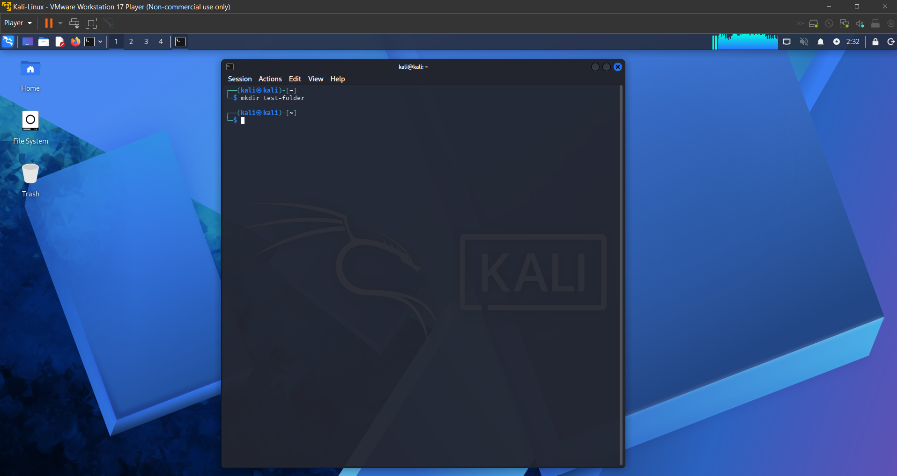

# Lab 2 - Kali Linux Fundamentals

## Overview
This lab demonstrates fundamental Linux commands and file system navigation using Kali Linux. The objective was to build a strong foundation in Linux usage, which is essential for IT support and cybersecurity roles.

---

## Lab Setup
- Host Machine: Windows Laptop  
- Virtualization: VMware Workstation Player  
- Virtual Machine: Kali Linux  
- Network Type: NAT  

---

## Tools Used
- Kali Linux Terminal  
- Linux Command Line  

---

## Tasks Performed
- Navigated directories using cd and ls  
- Created and removed files and folders  
- Modified file permissions using chmod  
- Viewed file contents using cat  
- Used sudo for administrative commands  

---

## Commands Used
- cd  
- ls  
- pwd  
- mkdir  
- rm  
- chmod  
- cat  
- sudo  

---

## File Permissions (chmod)

In this lab, file permissions were modified using the chmod command to control access to a script.

### Command Used
chmod 755 script.sh

### Explanation
The permission value 755 assigns different access levels to the owner, group, and others:

- Owner (7): Read, write, and execute permissions  
- Group (5): Read and execute permissions  
- Others (5): Read and execute permissions  

This means the file owner can fully modify and run the script, while all other users can only read and execute it.

### Verification
To confirm the permissions, the following command was used:

ls -l script.sh

Example output:
-rwxr-xr-x

### Key Takeaway
- The chmod 755 command is commonly used to make scripts executable while preventing unauthorized users from modifying them, improving system security and control.

---

## Results
- Successfully navigated the Linux file system  
- Created and managed files and directories  
- Applied and modified file permissions  

---

## Key Takeaways
- Gained hands on experience with Linux commands  
- Understood file permissions and directory structure  
- Built foundational skills for cybersecurity environments  

---

## Screenshots

### Initial Terminal

### Create Directory (mkdir)

### Sudo Command (Elevated Privileges)

### Remove Directory (rm)

### File Permissions (Basic)

### File Permissions and Scripting

---

## Conclusion
This lab reinforced my understanding of Linux fundamentals and command line operations within a Kali Linux environment. I developed practical experience navigating the file system, managing directories and files, and modifying permissions using essential commands. These tasks improved my confidence in working within a Linux terminal, which is a critical skill for both IT support and cybersecurity roles. Additionally, I gained a clearer understanding of how permissions control access to system resources. Overall, this lab provided a solid foundation for working in Linux environments and preparing for more advanced cybersecurity tasks.

