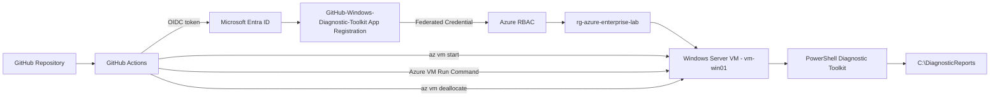
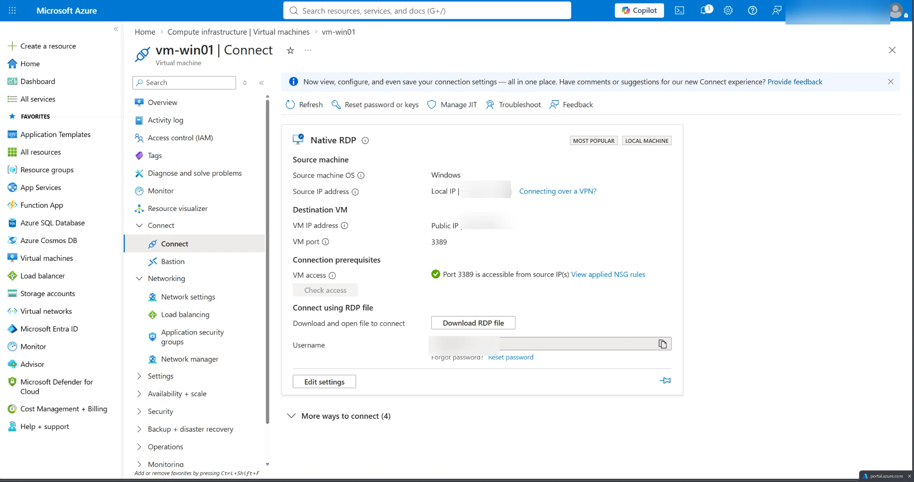
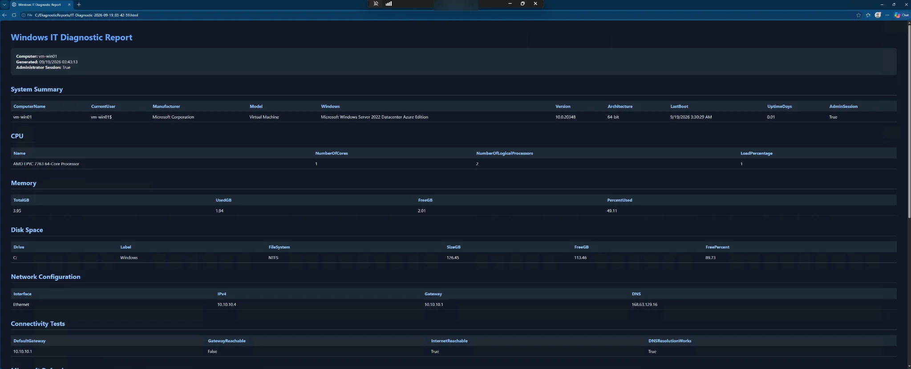

# Azure Windows Diagnostic Automation with GitHub Actions, OIDC, and Azure RBAC

## Overview

This lab demonstrates an end-to-end Azure automation workflow that securely runs a PowerShell-based Windows diagnostic toolkit against a Windows Server virtual machine from GitHub Actions.

The workflow uses **GitHub OpenID Connect (OIDC)** federation with a **Microsoft Entra ID app registration**, eliminating the need to store a long-lived Azure client secret in GitHub. Azure RBAC is scoped to the lab resource group, GitHub Actions starts the Windows VM, executes the diagnostic toolkit through **Azure VM Run Command**, and then deallocates the VM after execution.

The diagnostic script generates a persistent HTML report on the Azure VM at:

```text
C:\DiagnosticReports\IT-Diagnostic-<timestamp>.html
```

This lab combines cloud administration, identity federation, least-privilege authorization, CI/CD automation, Windows Server administration, PowerShell, remote diagnostics, and operational cost control.

---

## Project Repositories

**Standalone project documentation**

[azure-windows-diagnostic-automation-workflow](https://github.com/johninfra/azure-windows-diagnostic-automation-workflow)

**PowerShell toolkit and functional GitHub Actions workflow**

[windows-it-diagnostic-toolkit](https://github.com/johninfra/windows-it-diagnostic-toolkit)

---

## Architecture



### Authentication and Authorization Flow

```text
GitHub Actions
      |
      | GitHub-issued OIDC token
      v
Microsoft Entra ID
      |
      | Federated credential validation
      v
GitHub-Windows-Diagnostic-Toolkit
      |
      | Azure RBAC
      v
rg-azure-enterprise-lab
      |
      v
vm-win01
```

No Azure client secret is stored in the repository.

---

## Lab Environment

| Component | Configuration |
|---|---|
| Cloud Platform | Microsoft Azure |
| Identity Platform | Microsoft Entra ID |
| Compute | Azure Windows Server VM |
| VM | `vm-win01` |
| Resource Group | `rg-azure-enterprise-lab` |
| Automation Platform | GitHub Actions |
| Authentication | GitHub OIDC workload identity federation |
| Authorization | Azure RBAC |
| Azure Role | Virtual Machine Contributor |
| Remote Execution | Azure VM Run Command |
| Scripting | PowerShell |
| Report Output | HTML |
| Persistent Report Directory | `C:\DiagnosticReports` |

---

## Objectives

1. Connect a GitHub repository to Microsoft Entra ID without a client secret.
2. Configure a GitHub Actions federated credential for the `main` branch.
3. Apply least-privilege Azure RBAC at resource-group scope.
4. Authenticate GitHub Actions to Azure using OIDC.
5. Start a deallocated Windows Server VM automatically.
6. Execute the PowerShell diagnostic toolkit remotely with Azure VM Run Command.
7. Generate a persistent Windows diagnostic HTML report.
8. Deallocate the VM automatically after the workflow completes.
9. Validate the report through an administrative RDP session.
10. Document privacy and hardening considerations for public portfolio evidence.

---

## 1. Microsoft Entra Workload Identity

A dedicated Entra application registration was created:

```text
GitHub-Windows-Diagnostic-Toolkit
```

A GitHub Actions federated credential was configured for the repository and `main` branch.

The trust relationship allows Microsoft Entra ID to validate GitHub-issued OIDC tokens originating from the approved repository context.

### Why OIDC Was Used

Traditional CI/CD authentication can rely on stored client secrets. This lab instead uses workload identity federation:

```text
GitHub -> short-lived OIDC token -> Entra ID -> short-lived Azure access token
```

This reduces secret-management overhead and eliminates a long-lived Azure credential from GitHub.

---

## 2. Azure RBAC

The Entra service principal associated with the app registration was assigned:

```text
Virtual Machine Contributor
```

The assignment was scoped to:

```text
rg-azure-enterprise-lab
```

rather than the entire subscription.

This demonstrates the principle of **least privilege** by limiting the automation identity to the resource group required for the lab.

---

## 3. GitHub Repository Secrets

The GitHub Actions workflow references three repository secrets:

```text
AZURE_CLIENT_ID
AZURE_TENANT_ID
AZURE_SUBSCRIPTION_ID
```

These are identifiers used by `azure/login` to locate the correct Entra application, tenant, and Azure subscription.

A client secret is not required because authentication is performed through OIDC federation.

---

## 4. GitHub Actions Workflow

The workflow can be started manually with `workflow_dispatch`.

Core workflow sequence:

```text
Checkout repository
      |
      v
Authenticate to Azure with OIDC
      |
      v
Start vm-win01
      |
      v
Execute it-diagnostics.ps1
      |
      v
Generate C:\DiagnosticReports\IT-Diagnostic-*.html
      |
      v
Deallocate vm-win01
```

Representative workflow:

```yaml
name: Azure Windows Diagnostic Toolkit

on:
  workflow_dispatch:

permissions:
  id-token: write
  contents: read

jobs:
  diagnostics:
    runs-on: ubuntu-latest

    steps:
      - name: Checkout repository
        uses: actions/checkout@v4

      - name: Login to Azure with OIDC
        id: azure-login
        uses: azure/login@v2
        with:
          client-id: ${{ secrets.AZURE_CLIENT_ID }}
          tenant-id: ${{ secrets.AZURE_TENANT_ID }}
          subscription-id: ${{ secrets.AZURE_SUBSCRIPTION_ID }}

      - name: Start Windows VM
        run: |
          az vm start \
            --resource-group rg-azure-enterprise-lab \
            --name vm-win01

      - name: Run full Windows diagnostic toolkit
        run: |
          az vm run-command invoke \
            --resource-group rg-azure-enterprise-lab \
            --name vm-win01 \
            --command-id RunPowerShellScript \
            --scripts @it-diagnostics.ps1

      - name: Deallocate VM
        if: ${{ always() && steps.azure-login.outcome == 'success' }}
        run: |
          az vm deallocate \
            --resource-group rg-azure-enterprise-lab \
            --name vm-win01
```

---

## 5. Windows Diagnostic Toolkit

The automation executes `it-diagnostics.ps1`, which evaluates:

- Windows operating system information
- computer manufacturer and model
- CPU information and utilization
- physical memory utilization
- disk capacity and free space
- IPv4 network configuration
- default gateway and DNS configuration
- gateway connectivity
- internet connectivity
- DNS resolution
- Microsoft Defender status
- Windows Firewall profiles
- automatically-started services that are not running
- recent Windows critical/error events

The toolkit then generates a formatted HTML report.

---

## 6. Persistent Report Storage

The diagnostic script was configured to use:

```powershell
$reportFolder = "C:\DiagnosticReports"
```

If the directory does not exist, PowerShell creates it automatically.

Each execution generates a timestamped report:

```text
C:\DiagnosticReports\IT-Diagnostic-YYYY-MM-DD_HH-mm-ss.html
```

Using a fixed directory avoids relying on the temporary Azure Run Command plugin directory.

---

## 7. Validation

The completed report was validated by connecting to the Windows Server VM and opening the generated HTML document.

The report confirmed that the automation successfully collected system, CPU, memory, disk, network, connectivity, Defender, firewall, service, and event-log data from the Azure VM.

### Evidence

#### Azure VM connection validation

The Azure portal connection view confirms the Windows Server VM used for the lab and the RDP validation path. Public/source IP information and identifying connection details were redacted before publication.



#### Generated Windows diagnostic report

The completed automation generated a persistent HTML report from `vm-win01`, including system, CPU, memory, disk, network, connectivity, security, service, and event-log information.



The published evidence excludes authentication secrets, passwords, MFA information, reusable credentials, and unnecessary public connection details.

---

## Security Design

### OIDC Instead of Long-Lived Secrets

GitHub Actions authenticates using a short-lived OIDC token rather than an Azure client secret.

### Least-Privilege RBAC Scope

The automation identity is scoped to the lab resource group instead of receiving subscription-wide permissions.

### No Credentials in Source Code

Passwords, tokens, client secrets, recovery codes, and MFA values are not committed to the repository.

### Sensitive Portfolio Data Redaction

Public IP addresses and personal account identifiers were redacted from published screenshots where they were not necessary to demonstrate the technical outcome.

### VM Cost Control

The workflow automatically deallocates the VM after execution, preventing the compute resource from being left running unnecessarily.

### RDP Hardening Considerations

RDP was used to validate the generated report in the lab. In a production environment, administrative access should be tightly restricted with controls such as:

- Azure Bastion
- Just-in-Time VM access
- restricted NSG source ranges
- private connectivity/VPN
- strong identity and MFA controls

---

## Troubleshooting Performed

### Initial Report Path

The original diagnostic script used `$PSScriptRoot` for report storage. Under Azure Run Command, this resolved to the Run Command plugin's temporary working directory.

The script was updated to use:

```text
C:\DiagnosticReports
```

This made the report location persistent and predictable.

### Workload Authentication Validation

A lightweight `system-info.ps1` execution was used first to validate the end-to-end authentication and remote-execution path before running the full diagnostic toolkit.

This separated identity/RBAC troubleshooting from diagnostic-script troubleshooting.

---

## Skills Demonstrated

- Microsoft Azure administration
- Microsoft Entra ID
- workload identity federation
- OpenID Connect (OIDC)
- GitHub Actions
- CI/CD concepts
- Azure RBAC
- least-privilege access
- Azure Virtual Machines
- Azure VM Run Command
- Azure CLI
- Windows Server 2022
- PowerShell automation
- Windows diagnostics
- endpoint-security assessment
- HTML reporting
- RDP administration
- cloud troubleshooting
- operational cost control
- security-focused documentation

---

## Business Value

This workflow models an internal IT/cloud-operations process where administrators need to run standardized diagnostics against Windows infrastructure without manually signing into every server.

Potential enterprise uses include:

- standardized Tier 2 troubleshooting
- post-deployment health validation
- remote Windows diagnostics
- repeatable server checks
- support escalation evidence
- security posture validation
- automated operational reporting

The design separates source control, identity, authorization, compute, and execution into distinct components while using short-lived authentication and scoped Azure permissions.

---

## Lab Outcome

The final automation successfully performed the following:

```text
GitHub Actions
      |
      +--> Authenticated to Microsoft Entra ID with OIDC
      |
      +--> Received Azure authorization through RBAC
      |
      +--> Started the Azure Windows Server VM
      |
      +--> Executed the full PowerShell diagnostic toolkit remotely
      |
      +--> Generated a persistent HTML diagnostic report
      |
      +--> Deallocated the Azure VM
      |
      v
Successful automated Windows diagnostic workflow
```

This lab demonstrates practical cloud administration across **GitHub Actions, Microsoft Entra ID, Azure RBAC, Azure Virtual Machines, Azure CLI, PowerShell, and Windows Server** while applying identity-security and automation best practices.
