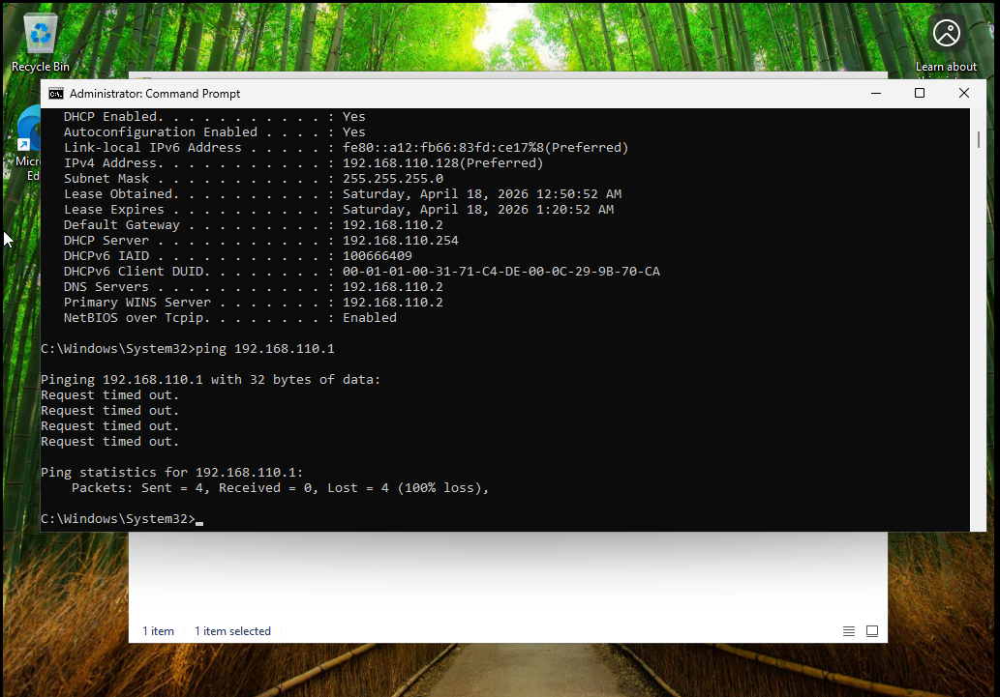
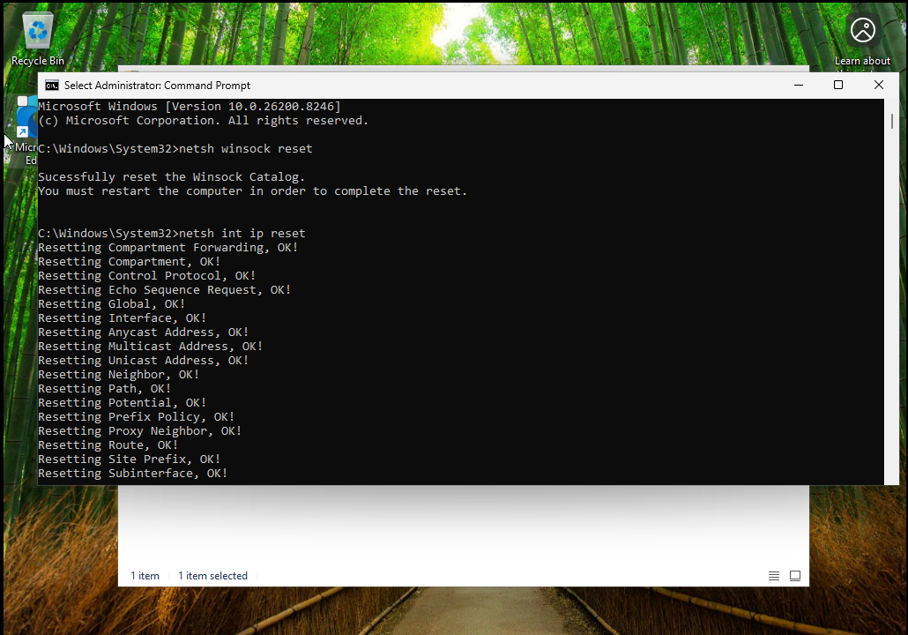
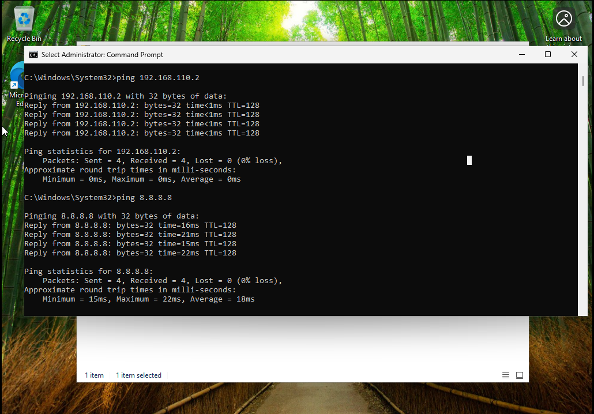
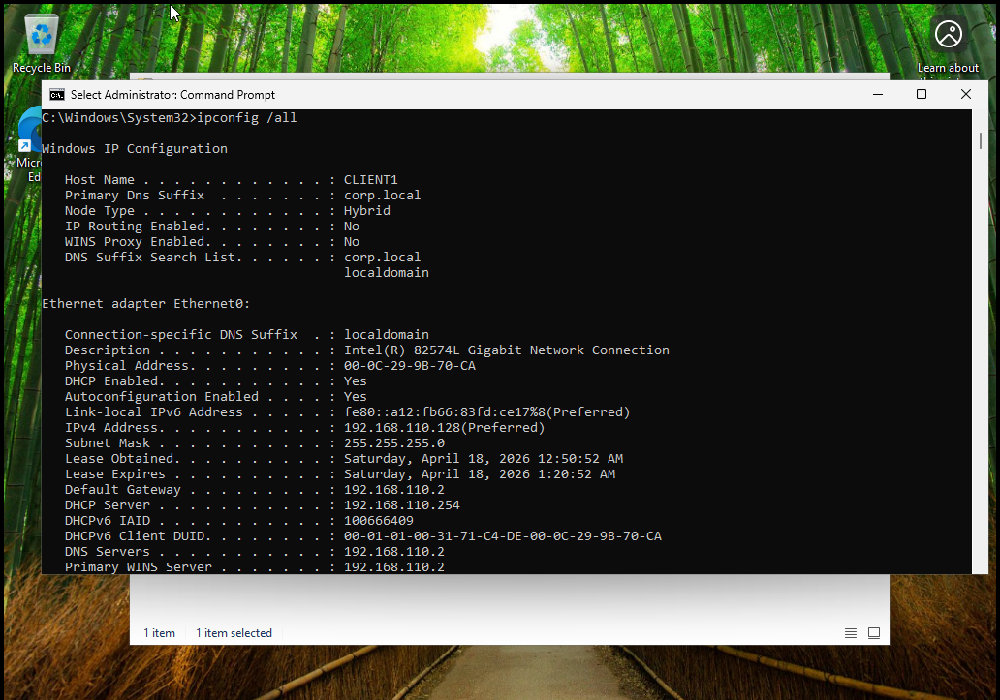

# Lab 3 - Network Troubleshooting

## Overview
This lab demonstrates troubleshooting network connectivity issues in a VMware virtual environment. The issue occurred after manually releasing the IP configuration, which caused the system to lose network access.

The objective was to restore connectivity using standard IT troubleshooting techniques.

---

## Lab Setup
- Host Machine: Windows Laptop  
- Virtualization: VMware Workstation Player  
- Client Machine: Windows 10 or 11 VM  
- Network Type: NAT  

---

## Tools Used
- Command Prompt  
- ipconfig  
- ping  
- netsh  

---

## Problem Encountered
After running:

ipconfig /release

The system lost network connectivity and was unable to reach the gateway or internet. The machine could not renew its IP configuration properly.

---

## Troubleshooting Steps

### 1. Tested Connectivity (Initial Failure)
Ran:

ping 192.168.110.1  
ping 8.8.8.8  

Result:
- Gateway unreachable  
- Internet unreachable  
- 100 percent packet loss  

---

### 2. Attempted to Renew IP Configuration
Ran:

ipconfig /renew

The system initially failed to restore proper network connectivity.

---

### 3. Reset Network Stack
Ran:

netsh winsock reset  
netsh int ip reset  

This reset the Windows network stack and cleared any corrupted settings.

---

### 4. Identified Correct Gateway
Discovered that the VMware NAT gateway was:

192.168.110.2

instead of the commonly expected .1

---

### 5. Retested Connectivity (Successful)
Ran:

ping 192.168.110.2  
ping 8.8.8.8  

Results:
- Successful replies  
- 0 percent packet loss  
- Internet connectivity restored  

---

### 6. Verified Final Configuration
Ran:

ipconfig /all

Confirmed:
- Valid IP address  
- DHCP enabled  
- Correct gateway  

---

## Results
- Successfully restored network connectivity by resetting the network stack, renewing DHCP configuration, and identifying the correct gateway within the NAT network.

---

## Key Takeaways
- Releasing IP configuration can temporarily break connectivity  
- DHCP renewal may fail if network configuration is unstable  
- VMware NAT environments may use .2 as the gateway  
- Network stack resets can resolve deeper connectivity issues  

---

## Conclusion
This lab demonstrated a real world network troubleshooting scenario where connectivity was lost after releasing the IP configuration. By systematically diagnosing the issue, resetting the network stack, identifying the correct gateway, and verifying network settings, full connectivity was restored. This exercise reinforced practical troubleshooting skills used in IT support roles.
