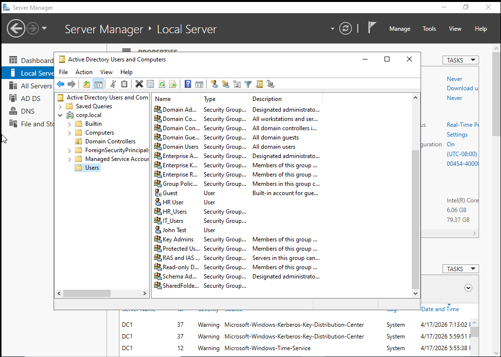
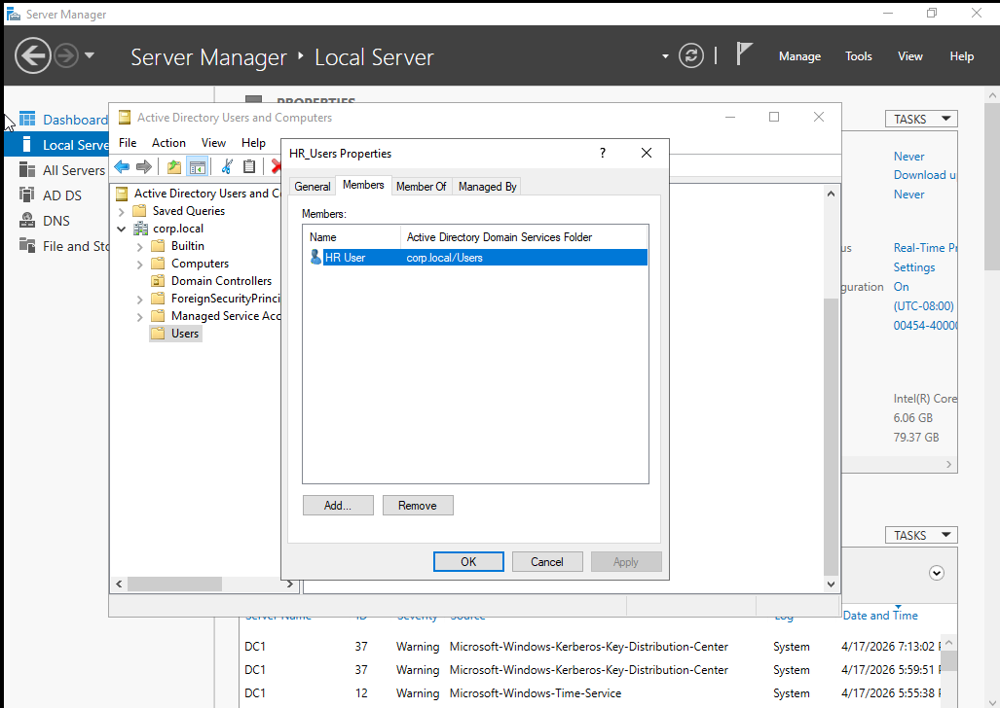
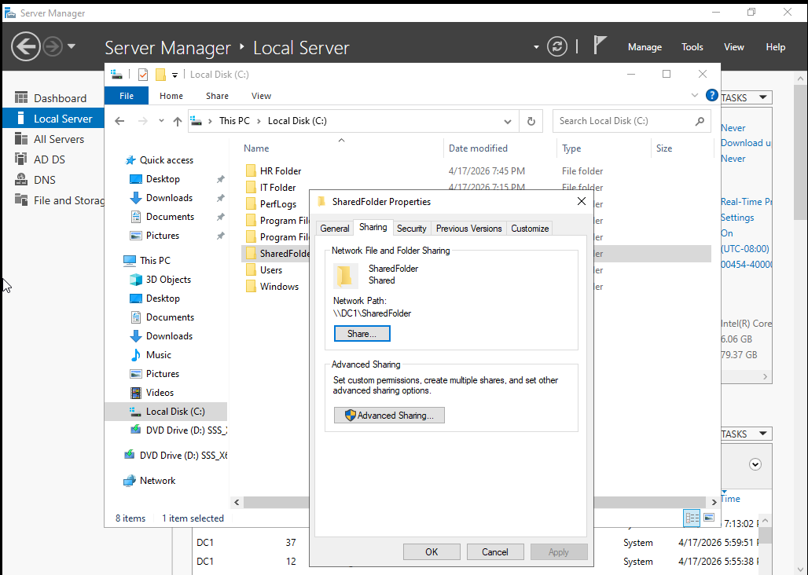
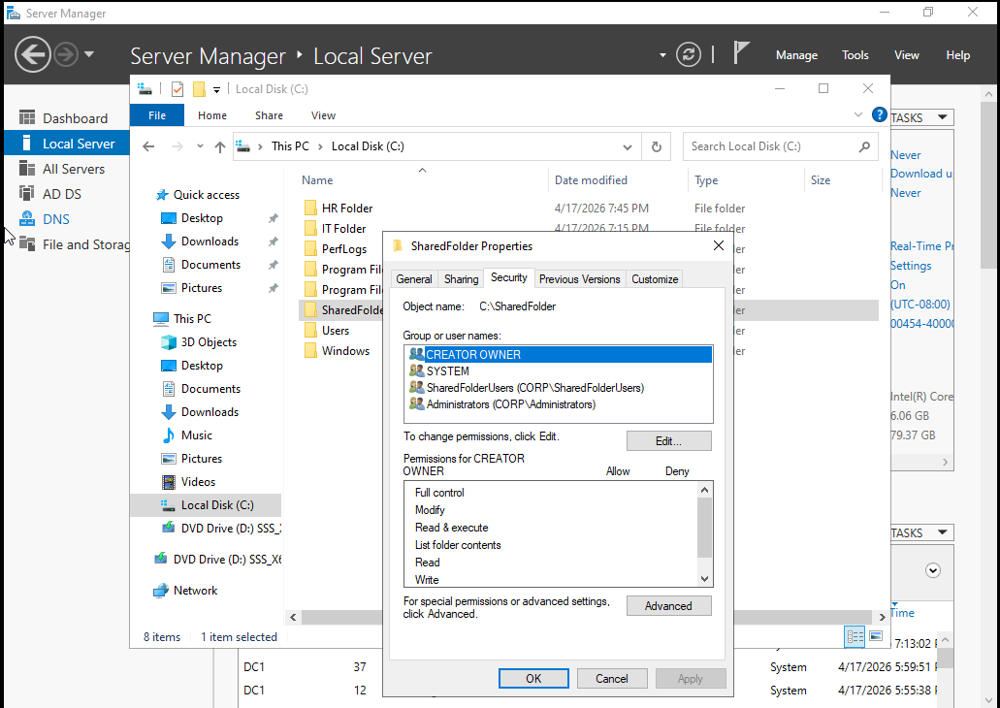
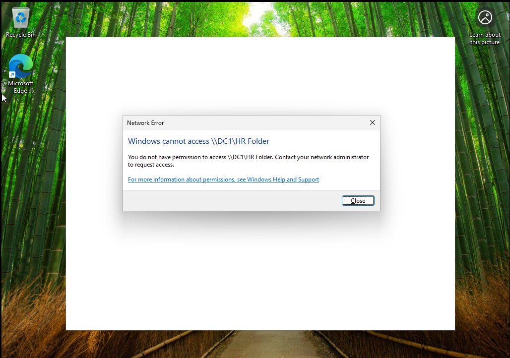
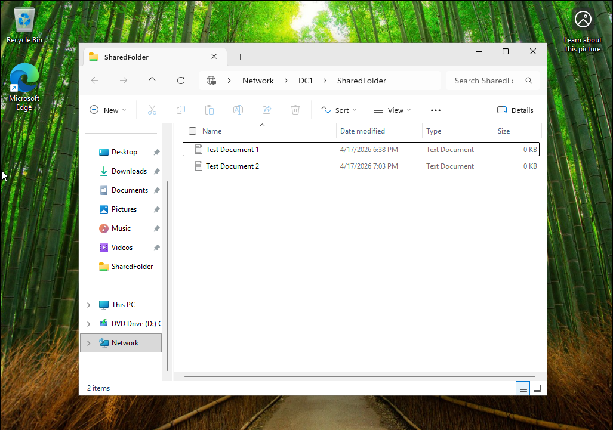
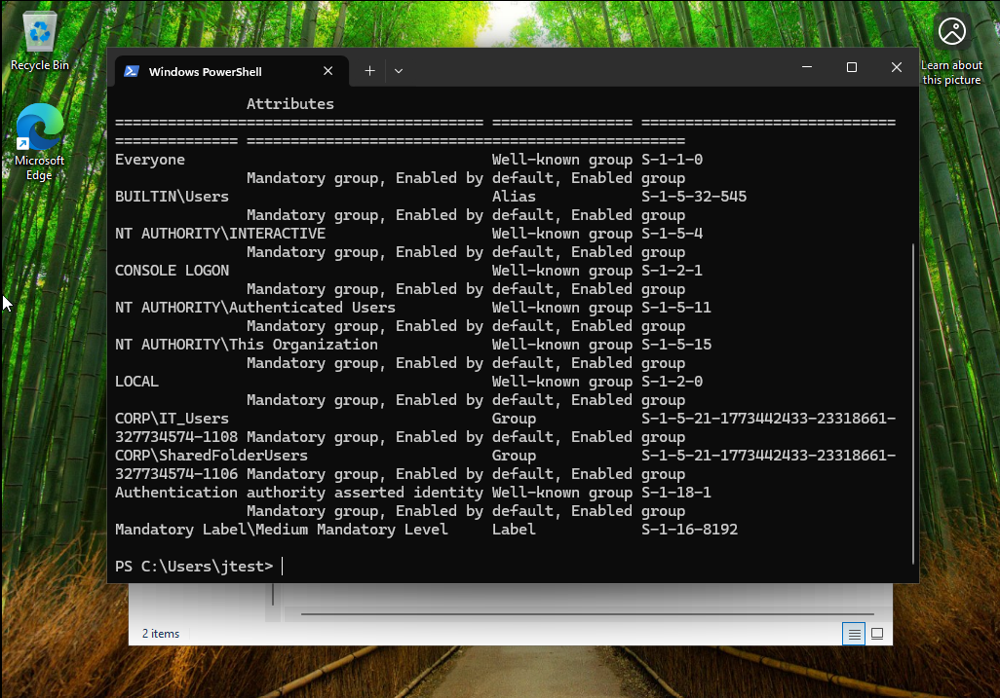

# Lab 4 Active Directory Group Based Access Control and Network Share Permissions Lab

## Overview
This lab demonstrates how to configure Active Directory users, security groups, and network shared folder permissions in a Windows domain environment. The goal was to simulate a real world IT scenario where access to shared resources is controlled using group based permissions and NTFS security across multiple departments.

## Lab Setup
- Host Machine: Windows Laptop
- Virtualization: VMware Workstation Player
- Domain Controller: Windows Server 2022 DC1
- Client Machine: Windows 10 or Windows 11 VM domain joined
- Domain: corp.local
- Network Type: NAT same subnet

## Tools Used
- Active Directory Users and Computers
- Server Manager
- File Explorer Network Shares
- Command Prompt
- Group Policy gpupdate
- whoami commands

## Network Configuration
- Domain Controller DC1 assigned private IP address
- Client VM assigned private IP address on same subnet
- Verified connectivity using ping between machines
- Client successfully joined to domain corp.local

## Tasks Performed

### Active Directory User Creation
- Opened Active Directory Users and Computers
- Navigated to corp.local Users
- Created user John Test with username jtest
- Created user HR User with username hr_user
- Set passwords and enabled both accounts

### Security Group Creation
- Created security group SharedFolderUsers
- Created security group HR_Users
- Set both groups as Global Security groups
- Added jtest to SharedFolderUsers
- Added hr_user to HR_Users

### Shared Folder Creation
- Created folder C:\SharedFolder
- Created folder C:\HR_Folder
- Enabled sharing for both folders
- SharedFolder accessible at \\DC1\SharedFolder
- HR_Folder accessible at \\DC1\HR_Folder

### Share Permissions Configuration
- Configured sharing permissions for SharedFolder
- Removed default access where necessary
- Added SharedFolderUsers and granted permissions
- Configured sharing permissions for HR_Folder
- Removed default access where necessary
- Added HR_Users and granted permissions

### NTFS Permissions Configuration
- Opened folder properties then Security then Advanced
- Disabled inheritance on both folders
- Converted inherited permissions into explicit permissions
- Removed default Users CORP Users group
- Added SharedFolderUsers with Modify or Full Control
- Added HR_Users with Modify or Full Control
- Ensured Administrators and SYSTEM retained Full Control

### Client Machine Testing
- Logged into client VM as jtest
- Accessed \\DC1\SharedFolder successfully
- Attempted to access \\DC1\HR_Folder and received access denied
- Logged into client VM as hr_user
- Accessed \\DC1\HR_Folder successfully
- Attempted to access \\DC1\SharedFolder and received access denied

### Access Verification
- Before configuration users received access denied errors
- After configuration users accessed only authorized folders
- Users were restricted from unauthorized folders

### Group Membership Verification
- Opened Command Prompt
- Ran whoami /groups
- Confirmed jtest is part of SharedFolderUsers
- Confirmed hr_user is part of HR_Users

### Group Policy Update
- Ran gpupdate /force
- Ensured updated permissions were applied
- Logged out and logged back in to refresh session

### Permission Troubleshooting
- Removed jtest from SharedFolderUsers
- Verified access was denied
- Re added jtest to SharedFolderUsers
- Logged out and logged back in
- Verified access was restored

### Inheritance and Security Control
- Observed default inherited permissions
- Disabled inheritance to enforce custom control
- Removed unnecessary default groups
- Implemented least privilege access model

## Results
- Successfully created multiple Active Directory users and groups
- Implemented group based access control
- Verified users only access authorized folders
- Demonstrated separation between departments
- Successfully tested access denial and restoration
- Confirmed proper NTFS and share permission configuration

## Key Takeaways
- Active Directory user and group management
- NTFS versus share permissions
- Permission inheritance and control
- Role based access control
- Department level access segmentation
- SMB network file sharing
- Group membership impact on access
- Troubleshooting permission issues

## Conclusion
This lab simulates a real world enterprise IT environment where multiple users and departments require controlled access to shared resources. By using security groups instead of assigning permissions directly to users, access control becomes scalable, secure, and easier to manage. The lab also demonstrates how to troubleshoot and validate permissions which is a critical skill in IT support and system administration roles.

## Screenshots

### Active Directory User Creation

### Group Membership Configuration

### Shared Folder Permissions

### NTFS Permissions Configuration

### Access Denied Test

### Successful Access Test

### Group Verification Command

