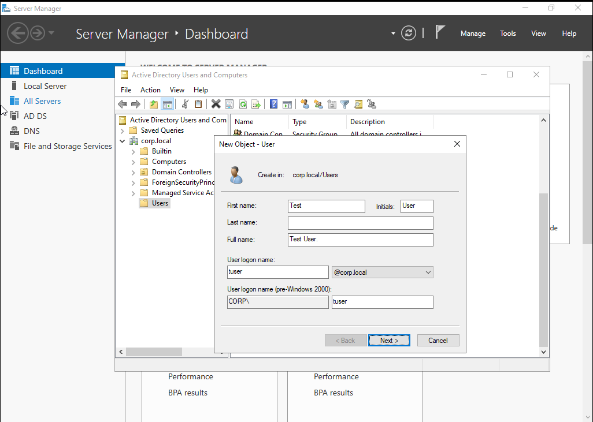
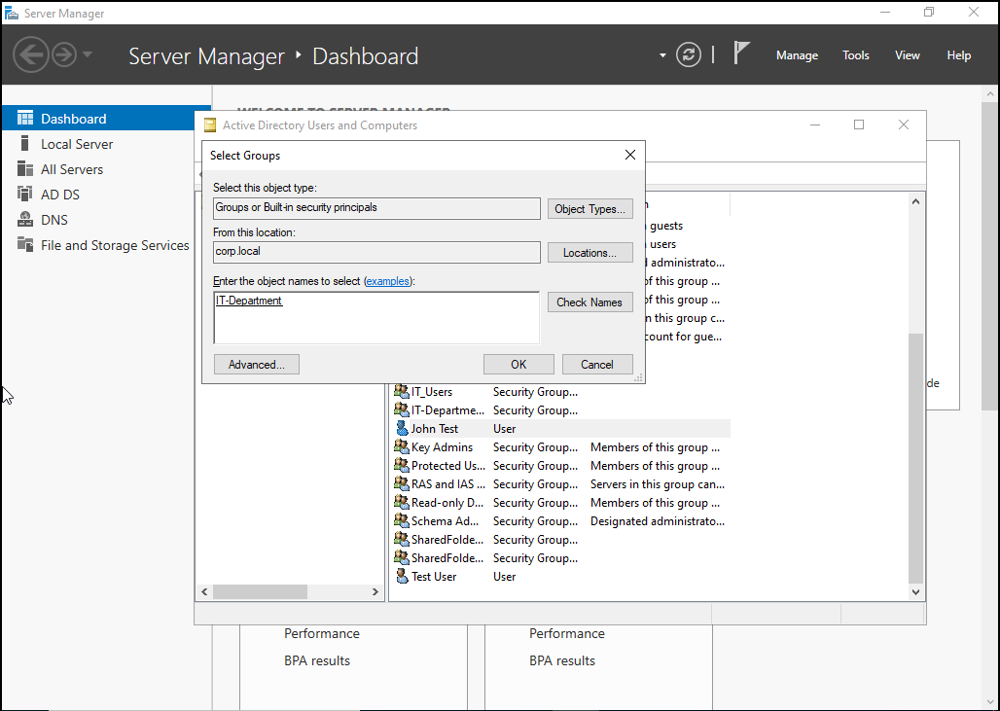
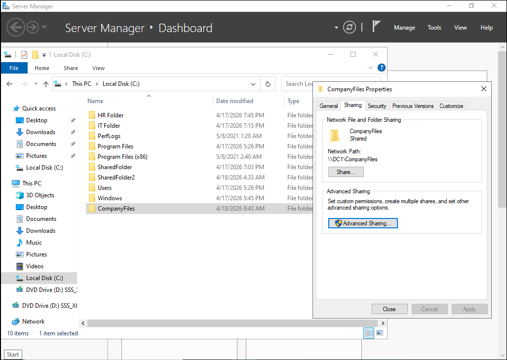
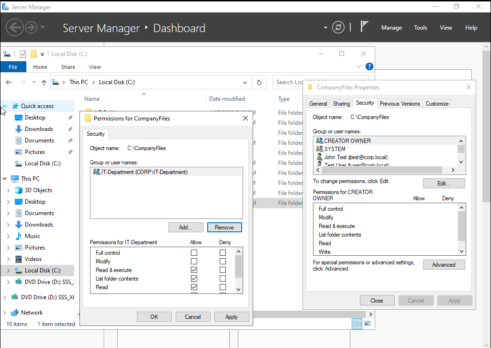

# Lab 6 - Active Directory User and Group Management

## Overview
This lab demonstrates how to create and manage users and groups in Active Directory and assign permissions to shared resources.

---

## Skills Demonstrated
- Active Directory user creation
- Security group management
- File sharing and permissions
- Access control validation

---

## Tasks Performed

### Created User

### Created Group

### Added User to Group

### Configured Shared Folder

### Set Permissions

### Verified Access

---

## Result
Successfully controlled access to a shared resource using Active Directory groups.
