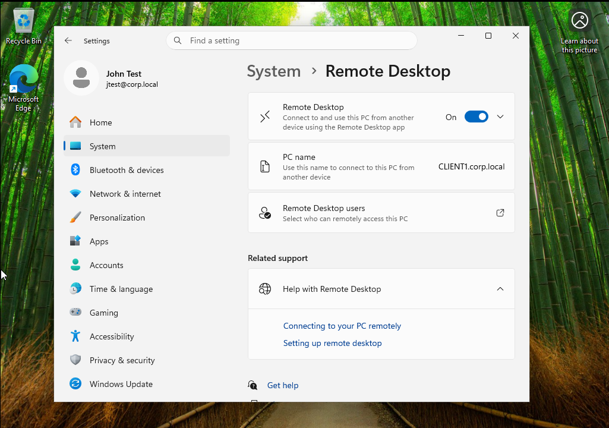
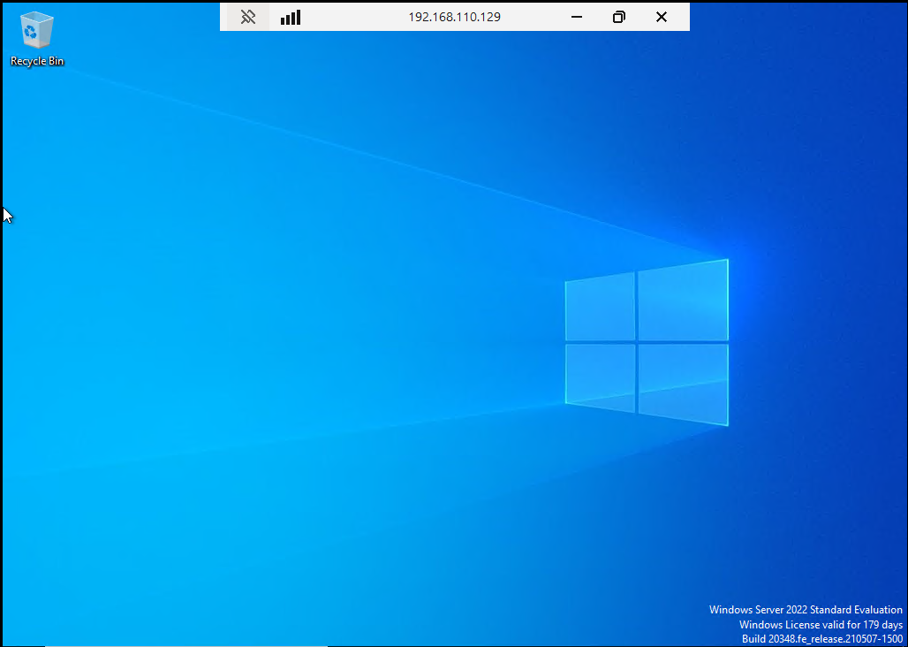
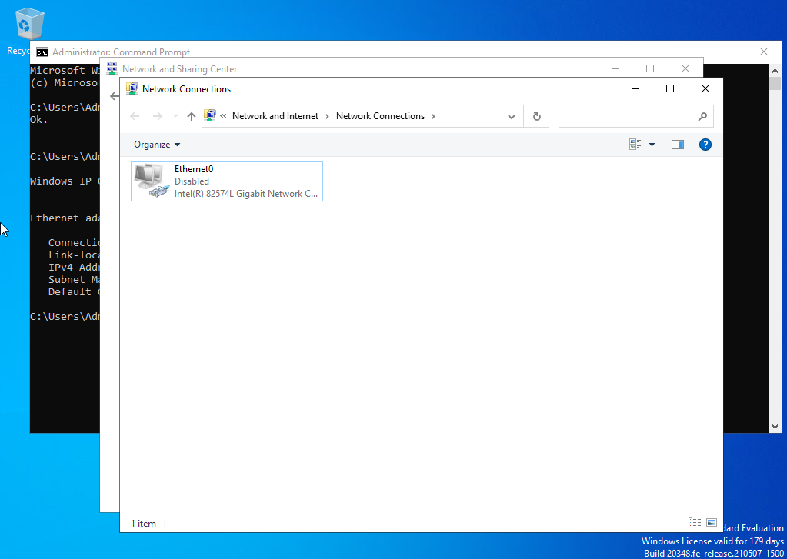
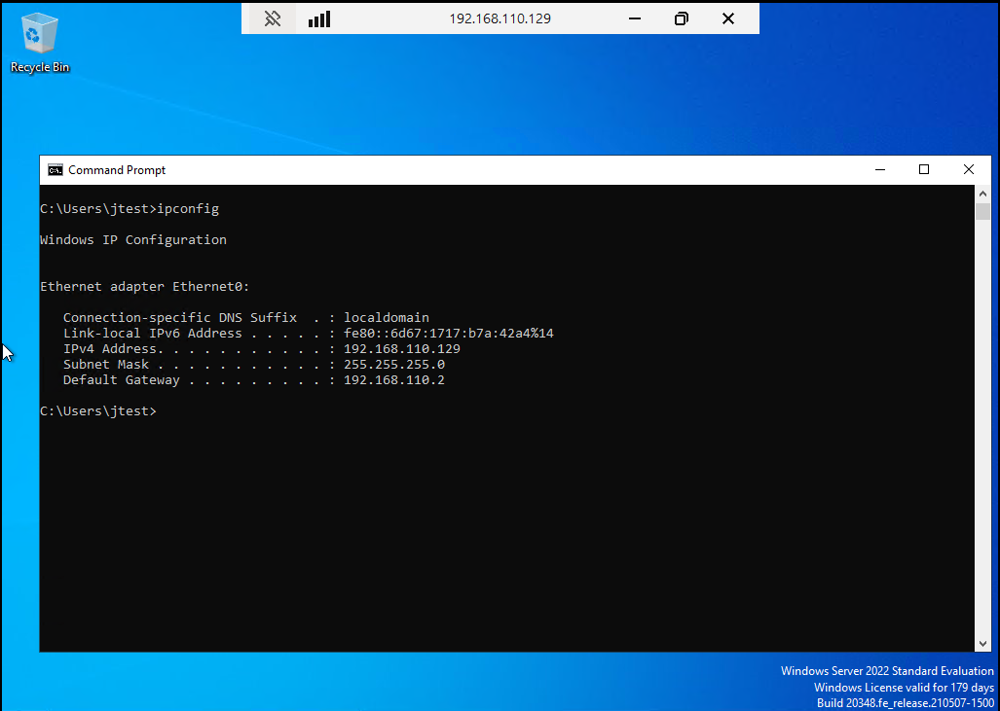
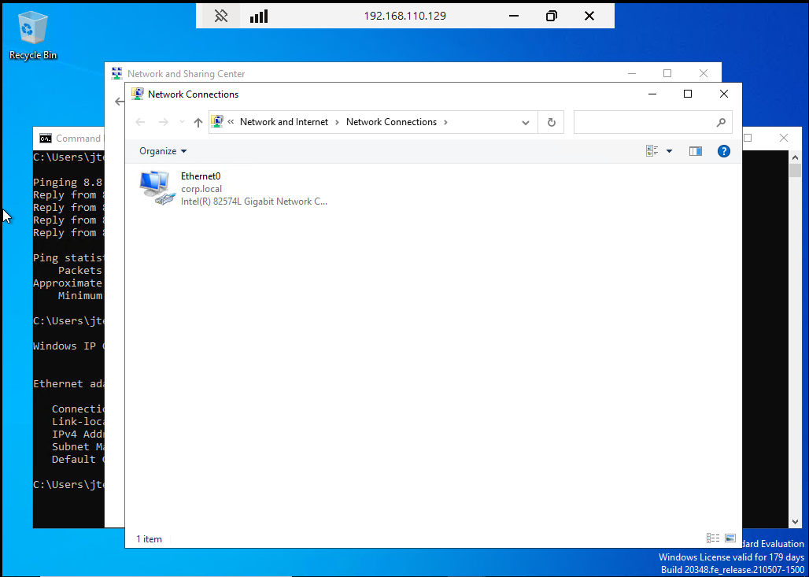
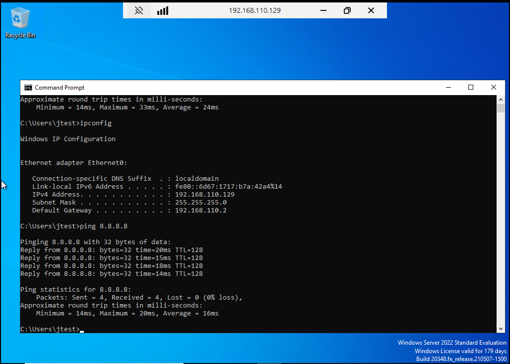

# Lab 6 - Remote IT Support Simulation

## Overview
This lab simulates a real world IT support scenario where a technician remotely connects to a client machine, diagnoses a network issue, and restores connectivity using standard troubleshooting techniques.

---

## Lab Setup
- Host Machine: Windows Laptop
- Virtualization: VMware Workstation Player
- Technician Machine: Host PC
- Client Machine: Windows 10/11 VM
- Network Type: NAT

---

## Tools Used
- Remote Desktop Protocol (RDP)
- AnyDesk
- Command Prompt
- ipconfig
- ping

---

## Problem Scenario
A user reports that their computer has lost internet connectivity. The technician must remotely access the system and resolve the issue.

---

## Troubleshooting Steps

### 1. Established Remote Connection (RDP)
Connected to the client VM using Remote Desktop.

---

### 2. Identified Network Issue
The network adapter was disabled, causing loss of connectivity.

---

### 3. Checked IP Configuration
Verified IP settings using ipconfig.

---

### 4. Resolved Issue
Re-enabled the network adapter.

---

### 5. Verified Connectivity
Ping test succeeded after fix.

---

## Results
- Successfully restored internet connectivity
- Diagnosed issue using remote troubleshooting techniques
- Simulated real world help desk workflow

---

## Key Takeaways
- RDP enables full remote system control
- Network adapter issues can cause connectivity loss
- Ping and ipconfig are essential troubleshooting tools
- Remote support tools like AnyDesk are widely used in IT environments

---

## Conclusion
This lab demonstrated a real world IT support scenario where remote troubleshooting was used to diagnose and fix a network issue. The process reinforced critical help desk skills such as remote access, connectivity testing, and system diagnostics.
