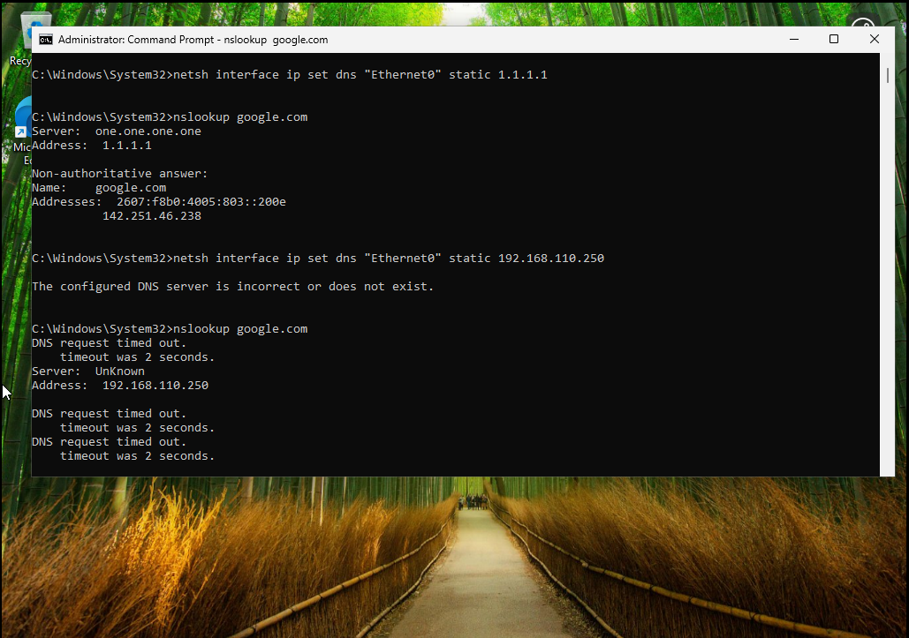
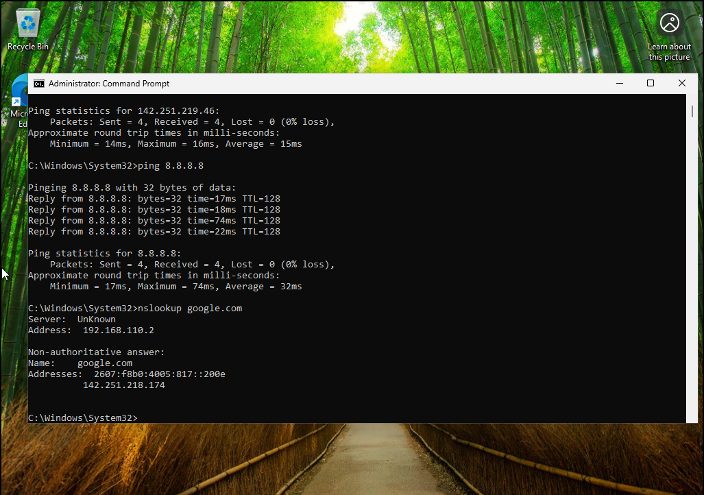

# Lab 8 - DNS and Network Connectivity Troubleshooting

## Overview
This lab demonstrates how to diagnose and resolve DNS related network issues.

---

## Skills Demonstrated
- DNS troubleshooting
- Network testing
- Command line tools

---

## Process

### DNS Failure

### IP Connectivity Works

### DNS Lookup

### DNS Fix

---

## Result
Successfully identified and resolved DNS issues affecting connectivity.
