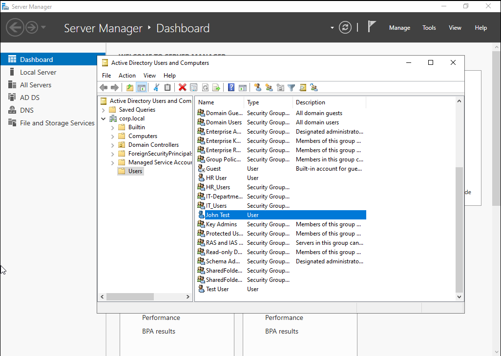
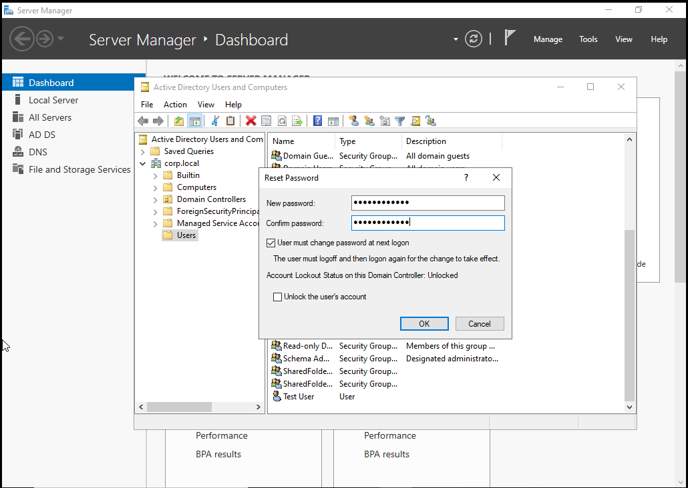
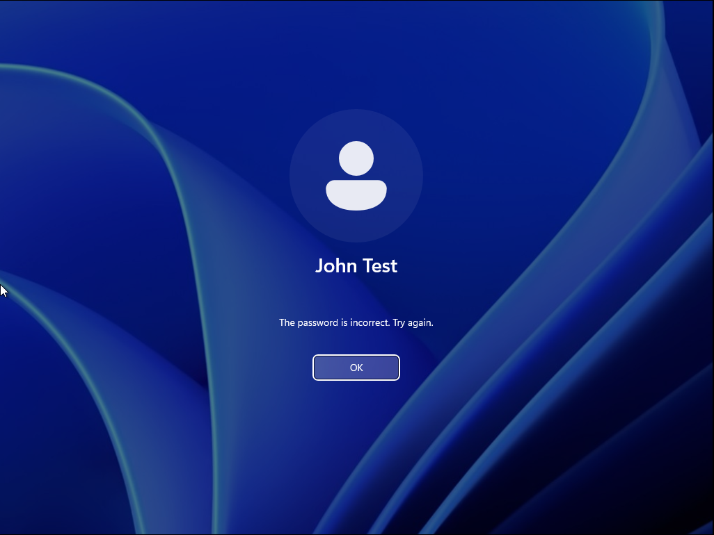
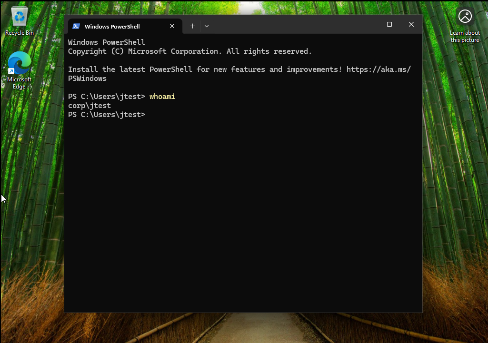

Lab 9 - Password Reset and Account Lockout Support

Overview  
This lab demonstrates how to perform password resets and unlock user accounts in an Active Directory environment. The goal was to simulate a real world IT support scenario where a user is unable to log in due to a forgotten password or account lockout. This lab reinforces help desk level troubleshooting skills and user account management within a domain.

Lab Setup  
- Host Machine: Windows Laptop  
- Virtualization: VMware Workstation  
- Domain Controller: Windows Server 2022  
- Client Machine: Windows 11 VM domain joined  
- Domain: corp.local  
- Network Type: NAT (same subnet)

Tools Used  
- Active Directory Users and Computers  
- Server Manager  
- Windows Security (Ctrl + Alt + Delete)  
- Command Prompt  
- Group Policy

Network Configuration  
- Domain Controller assigned private IP address  
- Client VM assigned private IP address on same subnet  
- Verified connectivity using ping between machines  
- Client successfully joined to domain corp.local  

---

Tasks Performed  

1. Opening Active Directory Users and Computers  
Opened Active Directory Users and Computers on the domain controller  

---

2. Selecting the User Account  
Navigated to corp.local Users  
Located and selected the user account (example: jtest)  

---

3. Resetting the Password  
Right clicked the user account and selected Reset Password  
Entered a new password and confirmed it  
Selected the option User must change password at next logon  
Clicked OK to apply changes  

---

4. Unlocking the Account  
Simulated account lockout through failed login attempts  
Returned to Active Directory Users and Computers  
Opened user Properties  
Navigated to the Account tab  
Checked Unlock account  
Clicked Apply and OK  

---

5. Verifying Successful Login  
Returned to Windows 11 client VM  
Logged in using the new password  
Confirmed successful login and access to the system  

---

6. Verifying User Context  
Opened Command Prompt on the client machine  
Ran whoami to confirm the logged in domain user  

---

Commands Used  
- gpupdate /force  
- whoami  
- ping [domain controller IP]

---

Results  
- Successfully reset user password in Active Directory  
- Simulated account lockout and resolved it  
- Unlocked user account using administrative tools  
- Verified successful login from client machine  
- Confirmed correct user context using command line  

---

Key Takeaways  
- Learned how to reset passwords in a domain environment  
- Understood how account lockouts occur and how to resolve them  
- Gained hands on experience with Active Directory user management  
- Developed real world help desk troubleshooting skills  

---

Conclusion  
This lab provided practical experience with password reset and account lockout scenarios in a domain environment. It demonstrated how IT support professionals assist users who are unable to access their accounts. By completing this lab, I strengthened my understanding of Active Directory account management and improved my ability to troubleshoot common login issues. These skills are essential for entry level IT support and help desk roles.
